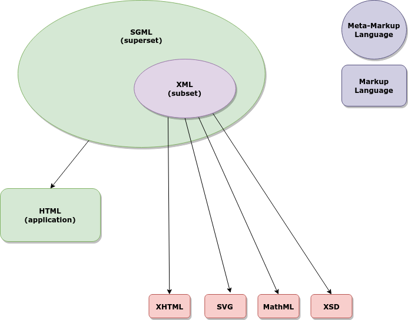
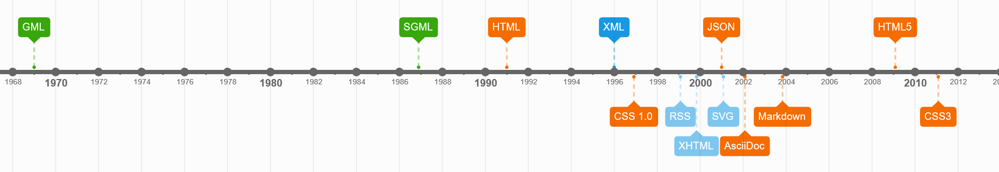

# Tema 1. Introducció als llenguatges de marques

!!! quote "Tim Bray, XML spec. coauthor"

    "The core idea of XML is to provide a standard, flexible way to create information formats and share both the format and the data on the World Wide Web, intranets, and elsewhere."

!!! quote "Jon Bosak led the creation of the XML specification at the W3C."

    "No se necesita ser un genio para diseñar un sistema basado en XML, pero se necesita ser un genio para hacer que funcione de manera eficiente." 

## 1.1. Què és XML?

**XML (eXtended Markup Language)** és un sistema de emmagatzemament d'informació basat en marques o etiquetes definides per l'usuari. XML es va dissenyar amb dos propòsits:

- **Emmagatzemar dades i presentar-les** de forma estructurada. Podem veure XML com una base de dades lleugera on l'informació està en format de texte. Les bases de dades estandar contenen informació binària no llegible amb un editor de texte.

- **Enviar informació per la xarxa**. Els servidors web disposen d'interfícies de comunicació (APIs) per comunicar-se amb altres servidors mitjançat l'enviament de fitxers. Aquí es fan servir tecnologies com SOAP (basat en XML) o JSON (té una sintaxi més senzilla que XML, basada en parells clau-valor). 

A continuació es descriu el procés general de creació d'un document XML:

1. A XML les **etiquetes no estan predefinides** com a HTML. Per tant, cada usuari ha de definir les seves etiquetes depenent de l'àmbit al que pertany el document. En aquesta part és important saber posar nom a l'informació, és a dir 'etiquetar'. Hem d'aprendre a definir conceptes que es transformaran en **etiquetes**.

2. Els llenguatges de marques han de complir una sèrie de regles. Aquestes regles faran que el **document XML sigui correcte sintàcticament o estigui ben format**. Per exemples, les etiquetes s'han d'obrir i tancar en ordre invers, els valors dels atributs han d’anar entre cometes, etc.

3. Una vegada tenim el document ben format, hem de **validar el document XML**, és a dir verificar que la informació que surt en el document XML s'ajusta a una sèrie de regles definides en el document de validació. Per exemple, indicant quins elements i atributs poden aparèixer, quins elements son optatius i quins no. Per exemple, podem definir un document XML per guardar els llibres d'una biblioteca, i definir que per a cada llibre i ha d'haver un element pel titol i un altre pel autor del llibre. En aquest cas parlariem d'un document vàlid. Hi ha dues **tècniques de validació de documents XML**: DTD i els esquemes XML (XSD). 
    * **DTD** és heratada de SGML, molt popular al anys 2000. 
    * **XSD** és una tecnologia més potent i actual.És el que veurem principalment en aquest mòdul. XSD és un llenguatge XML.

## 1.2. Què és i què no és XML.

**XML és un estandar** o norma, no una implementació concreta d'un llenguatge. És un **metallenguatge de marques**, és a dir no defineix cap conjunt d'etiquetes fixe, sino que els desenvolupadors poden crear els elements que necessitin amb l'estructura específica.

És un format flexible que permet adaptar-se a l'aplicació que desitgem. Per exemple:

* Si volguèssim fer un document per a la banca tindrem etiquetes com &lt;interes&gt;,
&lt;plaç&gt;, &lt;compte&gt; o &lt;desfalc&gt;.
* Si volem fer un document per a League of Legends, tindrem etiquetes com
&lt;campio&gt;, &lt;habilitat&gt;, &lt;objecte&gt; o &lt;encis&gt;.

### Què NO és XML?

* **XML no és un llenguatge de programació**, de forma que no existeixen compiladors de XML que generin programes executables. Els documents XML es poden generar o llegir des de les aplicaciones que creem. Per exemple, una aplicació d'escriptori pot guardar la seva configuració en format XML. Un compilador genera un arxiu executable pel S.O. mentre que un parser analitza un document i en genera un altre.

* **No és un protocol de comunicacions**, de forma que no enviarà dades per nosaltres a Internet, com tampoc ho fa HTML. Alguns  protocols de comunicacions són HTTP, FTP. Alguns protocols de comunicacions com [SOAP](https://en.wikipedia.org/wiki/SOAP) estan basats en XML.

* **No és un gestor de BBDD (SGDB)**. Una BBDD relacional pot contenir camps de tipus XML. Existeixen inclús BBDD natives en XML, és a dir que guarden i recuperen la informació en format XML, però aquests sistemes en sí mateixos no són una BBDD. XML és pot considerar una base de dades jeràrquica en format texte. Juntament amb altres llenguatges com XQuery permet fer consultes directament sobre les dades en format XML. 

XML té format de texte pla, i es pot transmetre per Internet doncs els arxius són relativament lleugers. L'**extensió dels arxius és .xml**. Són arxius de texte normals però per a que els navegadors i altres aplicacions el tractin con a XML utilitzem aquesta extensió.

## 1.3. Origen i evolució

Els llenguatges de marques són fonamentals en la informàtica i les telecomunicacions modernes, ja que permeten definir la manera en què es presenta i estructura la informació, tant per a la visualització humana com per al processament automatitzat per màquines. La idea de marcatge té arrels en la necessitat de donar més significat o informació addicional a certs elements dins d'un text, tal com fem en l'escriptura amb l'ús de majúscules, negretes, cursives i altres.

L'ús de marques per donar format a documents escrits es remunta a molts segles enrere, però en el context digital, el concepte de llenguatges de marques va començar a prendre forma a mesura que es va desenvolupar la informàtica. Durant els anys 60, a mesura que els ordinadors esdevenien més comuns en entorns corporatius i científics, va sorgir la necessitat d'unificar la manera com es creaven i compartien els documents entre diferents sistemes informàtics.

En l'àmbit informàtic, l'exemple més conegut són les pàgines web, un llenguatge de marques que ens permet donar format i transformar la informació que es mostra al nostre navegador web.

Les pàgines web fan servir el llenguatge de marques HTML. Aquest llenguatge permet modificar el títol d'una pàgina perquè es mostri més gran, modificar el color de la font, la disposició dels elements de texte dintre de la pàgina, etc. És a dir permet aplicar un format determinat a la informació.

Una **marca** és una senyal que delimita un texte, donant-li informació al navegador de com interpretar i renderitzar aquest texte al navegador. Les marques més comuns estan formades per una paraula delimitada pels símbols "<" i ">". Per exemple &lt;html&gt; o &lt;h2&gt;. 

Tal com hem comentat els llenguatges de marques no es consideren llenguatges de programació i per tant no podem dir que estem programant, ja que aquests llenguatges no disposen de sentències de control, funcions, etc. No obstant, els llenguatges de marques sí que es podem combinar amb altres llenguatges de programació, com ara Java, Javascript o PHP per mostrar la informació per pantalla d'una forma més ordenada i amigable.


### 1.3.1. Cronologia dels llenguatges de marques

- **GML** va ser creat per IBM a finals dels 60 com a solució a la falta de compatibilitat dels documents electrònics que s'enviaven entre els diferents mainframes de l’època. GML va proporcionar una manera estandaritzada de descriure l'estructura i format dels documents. 

- **SGML**. La necessitat d'estandarització de GML va porta al desenvolupament de SGML. va passar a formar part de l'estàndar ISO (ISO 8879) el 1986. SGML es defineix com a metallenguatge, és a dir, permet crear altres llenguatges de marques (un d'ells HTML). 

    Exemple de document SGML (recipe.sgml):

```sgml
<!doctype recipe system "recipe.dtd">
<recipe>
  <title>Chocolate fudge</title>
  <comment>My mother's recipe</comment>
  <ingredients>
    <ingredient quant='1' lb>sugar
    <ingredient quant='4' oz>chocolate
    <ingredient quant='&amp;frac12;' pt>cream
    <ingredient quant='1' oz>butter
  </ingredients>
  <method>
    <list>
      <item>Mix the ingredients in a pan
      <item>Heat to 234&amp;deg;F, stirring constantly
      <item>Pour into greased flat tin
      <item>Allow to cool before cutting
    </list>
  </method>
  <source>Adapted from the Good Housekeepings cookbook</source>
</recipe>
```

Encara que SGML va establir les bases per a molts dels llenguatges de marques més específics (HTML o XML), la seva complexitat va fer difícil adoptar-lo en alguns entorns.

* Amb la creació de la World Wide Web a principis dels anys 90, es va fer evident la necessitat d'un llenguatge de marques específicament dissenyat per a la creació de pàgines web. Això va donar lloc a **HTML (HyperText Markup Language)**. Tim Berners-Lee va crear la web (conjunt de protocols i llenguatges, entre ells HTML) a finals de 1990, fent un esforç de simplificació de SGML, que es considerava un llenguatge força complicat. HTML també deriva de SGML, però no és un metallenguatge. L’última versió de HTML, HTML5 va sortir el 2014. Apart dels llenguatges abans esmenats, n'hi ha d'altres basats en XML.

* **XML (eXtensible Markup Language)**. L'any 1996 va sorgir el primer esborrany de l'especificació del **XML**. La primera versió de XML (**XML 1.0**) es va definir l'any 1998. XML és deriva de SGML i es considera un **metallenguatge**.

* La versió XML 1.1 va sortir al febrer de 2004. Conté algunes característiques amb usos molt específics i no està gaire implementada. Es recomana només si volem fer servir les seves característiques especials. 

!!! note "Quina versió utilitzarem per defecte??"

    Nosaltres utilitzarem la versió 1.0 d'XML.

La següent imatge relaciona els diferents llenguatges de la família GML.




### Timeline llenguatges de marques



## 1.4. Característiques dels llenguatges de marques

Els llenguatges de marques tenen les següents característiques:

* **Text pla.** 
Els llenguatges de marques fan servir fitxers de text pla. Això vol dir que els podem obrir amb qualsevol editor de texte a qualsevol sistema operatiu, ja sigui amb la línea d'ordres (shell) o amb una aplicació d'escritori (p. ex. notepad).

* **Compactness (compactibilitat).** 
Les instruccions de marcatge estan barrejades amb el propi contingut, com per exemple a l'Activitat 1.

* **Independència del dispositu final.** 
El mateix document es pot interpretar de diferent forma depenent de la resolució del dispositiu: mòvil, PC, tablet.

* **Especialització.** 
Els llenguatges de marques han evolucionat i és fan servir en moltes àrees, no només en la visualització de documents. Tenim llenguatges per a gràfics vectorials (SVG), matemàtiques (MathML), posicionament GPS (GPX), sindicació de continguts (RSS), ePub, síntesi de veu, etc.

* **Flexibilitat.** Els llenguatges de marques es poden combinar en el mateix arxiu amb altres llenguatges, com per exemple HTML amb llenguatges com PHP o Javascript. En aquest cas es fan servir etiquetes especials per indicar quan comença i termina el codi de programació. XHTML permet combinar MathML i SVG en un mateix document. 

## 1.5. Classificació dels llenguatges de marques

Podem classificar els llenguatges de marques segons els tipus de marques que utilitzen:

* **Presentació**.
Aquests llenguatges especifiques característiques com el tamany de la font, centrar el texte o cambiar una paraula a negreta o cursiva. Els procesadors de texte i en general les aplicacions d'edició professional fan servir aquest marcatge.

* **Descriptiu, estructural o semàntic**.
En aquest cas els llenguatges especifiquen com s'estrucura el document, sense especificar com s'han de presentar a la pantalla. Aquests llenguatges creen documents amb **estructures d'arbre** que emmagatzemen la informació. Per tant podríem parlar de bases de dades. No obstant això, els llenguatges de marques no tenen algunes de les característiques de les BBDD com les taules o les regles d'integritat, i tanbé se les anomena **Bases de Dades semiestructurades**.

* **Híbrid**.
Aquests llenguatges contenen marques dels dos tipus anteriors.


## 1.6. Importància en el context actual

Actualment els llenguatges de marques es fan servir de forma intensiva en alguns àmbits de la informàtica. Tota la web està basada en llenguatges de marques (HTML, XHTML), així com els principals formats d'arxius de texte editable. Word (**doc, docx**), Excel (**xls, xlsx**) o **ePub** (e-books) són llenguatges de marques. El format **IDocs** (utilitzar per SAP en els seus sistemes i basat en llenguatge de marques) s'utilitza a les empreses per enviar-se entre elles documents comercials (factures, albarans...). L'administració pública només admet documents signats digitalment (facturae), així que totes les empreses han d'adaptar els seus sistemes per enviar la informació digitalment enlloc de per correu o altres mètodes.

Els llenguatges de marques continuen sent crucials per al desenvolupament i la gestió de contingut digital (per exemple **Markdown**, **ASCIIDoc** o **JSON**). Amb la creixent demanda de contingut personalitzat, dinàmic i accessible a través de múltiples dispositius, l'ús de llenguatges de marques com HTML, XML, i els seus derivats s'ha expandit a noves àrees. Això inclou l'**Internet de les Coses (IoT)**, la **intel·ligència artificial (IA)** i la gestió de dades massives (**Big Data**), on la capacitat de definir, intercanviar i processar dades de manera eficient és més important que mai.

Aquest document està llicenciat sota els termes de la [Licencia Creative Commons Attribution 4.0 International (CC BY 4.0)](LICENSE.md).