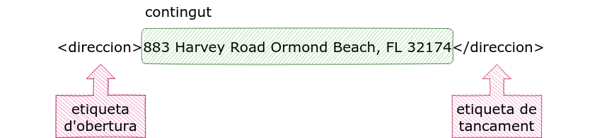
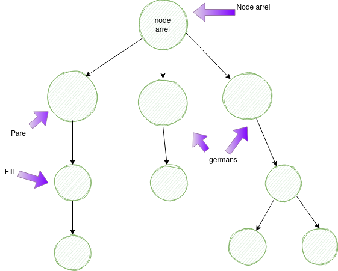

# Tema 2. Emmagatzemament de dades (XML)

!!! quote "Elliotte Rusty Harold, autor y experto en XML"

    "XML es como el cartón. No está diseñado para ser bonito, pero es muy útil para envolver cosas."
    
    "La verdadera belleza de XML radica en su simplicidad. Un formato de texto que cualquier ser humano puede leer, pero que también puede ser procesado por una máquina."


## 2.1. Conceptes bàsics

En aquest capítol es descriuen els blocs de construcció del llenguatge de marcatge XML: elements, atributs i declaracions, entre d'altres. Els elements i els atributs són els elements més utilitzats.

### 2.1.1. Etiquetes

Les etiquetes delimiten els elements. També permeten insertar comentaris i instruccions especials. La següent taula resumeix els tipus d'objectes XML juntament amb el símbol utilitzat per representar-lo.

| Tipus d'etiquetes XML | Objectiu | Etiqueta | Exemple |
|--------------------------|----------|---------|---------|
| element | Agrupar elements i dades de caràcter. | <n_element> | **`<p>`**`Això és un paràgraf.`**`</p>`** 
| element buit | Representar informació en un punt específic del document. | <n_element /> | **`<xref`**` linkend="abc"`**`/>`** |
| declaració | Afegir un nou paràmetre, entitat o definició de gramàtica a l'entorn d'anàlisi. | <!> | **`<!`**`ENTITY author "Salva J.">` |
| instrucció de processament | Enviar una instrucció especial a un tipus particular de programari. | <?xml> | **`<?`**`xml version="1.0" ?>` |
| comentari | Inserir una anotació que serà ignorada pel processador XML. | <!--> | **`<!`**`-- ultima revisio: juny 2023 -->` |
| secció CDATA | Crear una secció de dades de caràcter que no s'ha de parsejar, preservant qualsevol caràcter especial a dins. | <!> | **`<![CDATA[`**`Ampersands a dojo! &&&&&&]]>` |
| referència d'entitat | Ordenar al parser que inserteixi un text emmagatzemat en un altre lloc. | `&author;` |

Els elements són els objectes més comuns. Els elements permeten dividir i estructurar el document en parts cada vegada més petites que s'encaixen com una matrioska.

### 2.1.2. Documents: pròleg.

Els documents XML consten de dues parts: el pròleg i l'element del document, també anomenat element arrel.
El pròleg conté metadades, és a dir informació adicional sobre les dades del document xml. El pròleg és opcional, en aquest cas el programa que processi el document agafarà valors per defecte com el joc de caracters UTF-16 o UTF-8. Nosaltres sempre utilitzarem un **pròleg mínim que conté una instrucció de processament** ```<?xml version="1.0" encoding="UTF-8"?>```. 

Exemple d'un pròleg d'XML 

```dtd
    <?xml version="1.0" standalone="no" ?> 
    <!DOCTYPE 
    reminder                          
    SYSTEM "/home/eray/reminder.dtd"  
    [ 
    <!ENTITY smile "<graphic file="smile.png"/>"> 
    ]> 
    <reminder> 
        &smile; 
        <msg>Smile! It can always get worse.</msg>
    </reminder> 
```

### 2.1.3. Declaració XML. 

La declaració xml o instruccio de processament és la primera línea del document.

1. Aquesta instrucció **ha de ser la primera línea del document** per a què el document s'interpreti correctament. Comença per &lt;? i termina
per ?&gt;. 

2. La farem servir sempre per evitar problemes de compatibilitat. És a dir, **és obligatòria**.

3. La declaració es processada pel programa que analitza els documents XML, per exemple el navegador web. Aquestes instruccions són independents del document XML i no formen part del document XML. 

    Exemple:

    ```dtd
          <?xml version="1.0" encoding="utf-8" standalone="yes" ?>
    ```

4. L'etiqueta `<?xml ... ?>` té els següents paràmetres o *atributs*:

    4.1. ***version***:  és obligatori, indica les característiques XML que fa servir el document. 

    4.2. ***encoding***: indica la codificació (el joc de caràcters) que podem utilitzar en el document XML. UTF-8 és el més estàndar i admet els caràcters latins. Opcional

    4.3. ***standalone***: El farem servir a temes posteriors. Indica si un document XML está enllaçat amb altre document. De moment posarem sempre ***yes***. Opcional.

### 2.1.4. Declaració de tipus de document. Document Type Declaration (DTD)

La secció DTD està delimitada pels caràcters **`<!DOCTYPE`** i pel tancament **`]>`**. Aquesta secció permet fer vàries coses:

* Definir un arxiu extern de validació DTD. Aquest arxiu extern permet validar l'arxiu XML, indicant el nom dels elements, el tipus de dades, l'ordre d'aparició, etc., tal com veurem al [tema 3 (XSD)](/docs/03-xsd.md))

* Declarar variables i valors per defecte (constants).

A continuació tenim un exemple de DTD:

```dtd
<!DOCTYPE reminder                          
  SYSTEM "/home/eray/reminder.dtd"  
  [ 
    <!ENTITY smile "<graphic file="smile.png"/>"> 
  ]> 
```

* **reminder** és el nom de l'element arrel, el tipus de document.

* La paraula clau **SYSTEM seguit d'una ruta** indica un arxiu local que conté les declaracions DTD.

* Entre els claudàtors tenim les **definicions de variables (ENTITY)**. En aquest cas es tracta d'una entitat externa que serveix per incorporar a l'arxiu XML altres arxius no parseables directament per XML (per exemple, imatges o altres arxius). També es poden definir variables amb la mateixa sintaxi:

```dtd
<!DOCTYPE reminder                          
  [ 
    <!ENTITY nom-variable valor-variable> 
  ]> 
```

### 2.1.5. Elements. 

### 2.1.5.1. Element arrel. 

```xml
<reminder>                                Element arrel
    &smile;                               Referencia a l'entitat anterior
    <msg>Be water my friend.</msg>
</reminder>                               Fi del element arrel.
```

L'arrel és el primer element que trobem després del pròleg. Es fa servir principalment per recòrrer l'arbre XML i per processar la resta de nodes.
Només hi pot haver-hi un. No té ni ascendents ni germans, només descendents.

### 2.1.5.2. Elements. 

Dintre de l'arrel normalment hi ha altres elements. L'element és la unitat bàsica dels documents XML i contenen la informació del document. Delimiten la informació fent servir una **etiqueta d'obertura** i una **altra de tancament**. Entre aquestes etiquetes es troba el contingut de l'element, que pot ser una dada, altres elements o estar buit. L'etiqueta de tancament és obligatòria.



### 2.1.5.3. Elements buits. 

No tenen contingut, normalment utilitzen atributs i s'obre i es tanca amb una sola etiqueta. Exemple:

```dtd
<location lat="40.7128" lon="-74.0060" />
```

Els elements buits poden o no tenir atributs i la seva sintaxi es pot expressar com:

```dtd
<element></element>
```

encara que normalment s'especifiqui així amb una sola etiqueta:

```dtd
<element />
```

Alguns elements buits poden no tenir atributs. Per exemple, a HTML l'element `<hr>` dibuixa una linea horizontal al la pàgina web.

```html
<hr>
```

Sortida:

<hr>

### 2.1.5.4. Atributs. 

A l'etiqueta d'obertura d'un element podem afegir dades adicionals mitjantçant l'ús d'atributs. Són parells nom-valor amb la següent sintaxi:

```xml
    <element atribut="valor"> ... </element>
```

Es fan servir per emmagatzemar informació adicional sobre el contingut. Per exemple, per especificar les unitats de mesura:

```xml
    <pes unitats="Kg"> 80 </pes>
```
També es poden fer servir per indentificar un element per distingir-lo d'un altre:

```xml
    <capitulo materia="Lenguaje Marcas">
      <tema> Introducción </tema>
      <capitulo_1 subapartado="1"> Conceptos y ventajas </capitulo_1>
      <capitulo_1 subapartado="2"> SGML el origen </capitulo_1>
    </capitulo>
```

Un element pot tenir un nombre il·limitat d'atributs, en funció de la memòria RAM disponible. 

```xml
    <product id="12345" name="Smartphone" category="Electronics" price="699.99" currency="USD" inStock="true" />
```

El nom dels atributs no es pot repetir, per tant el següent fragment és incorrecte.

```xml
  <!-- atributs incorrectes -->
  <product id="12345" name="Smartphone" category="Electronics" category="GPS" />
```

Per resoldre aquest problema tenim vàries solucions. Podem crear una llista de categories dintre d'un únic atribut:

```xml
  <product id="12345" name="Smartphone" category="Electronics GPS"/>
```

o utilitzar elements:

```xml
  <product id="12345" name="Smartphone">
      <category>Electronics</category> 
      <category>GPS</category>
  </product> 
```

### 2.1.5.5. Texte.  

El texte representa les dades d'un document XML. Pot aparèixer com a contingut d'un element o com a valor d'un atribut, i no pot aparèixer en cap altre lloc. Per a representar els espais en blanc tenim quatre tipus de caràcters a XML:

| Nom             |Simbol | Codi  | Abreviatura |
|-----------------|-------|-------|-------------|
| Tabulador       | \\t    | \&#9;  | TAB         |
| Nova línea      | \\n    | \&#10; | LF          |
| Retorn de carro | \\r    | \&#13; | CR          |
| Espai           | \\s    | \&#32; | SPACE       |

És possible mesclar texte i elements dintre d'un element, anomenat **contingut mixte**.


### 2.1.5.6. Estructura d'un document XML

La informació a un document XML s'organitza en forma **jeràrquica**. Els elements es relacionen entre ells com en un arbre genealògic, mitjançant relacions: pares, fills, germans, nets...



Aquesta estructura jeràrquica es denomina **arbre**. En informàtica, un arbre és una estructura de dades que té forma d'arbre invertit, comença amb un element arrel i cada element o node està connectat amb altre/s node/s. Als nodes que no tenen fills se'ls anomena **nodes finals o fulles** i a la resta **nodes intermitgos o branques**.

Per exemple, si volem tenir una agenda, crearem l'element &lt;persona&gt; que conté els elements &lt;nom&gt;, &lt;cognoms&gt; i telèfons que a la seva vegada pot contenir múltiples numeros.

```xml
    <persona>
      <nom>Joan</nom>
      <cognoms>Pérez Garcia</cognoms>
      <telefons>
        <movil>6658654523<movil>
        <fixe>9375856554</fixe>
      </telefons>
    <persona>
```  

Els espais en blanc entre elements són ignorats.

### 2.1.6. Comentaris. 

Els comentaris comencen pels caràcters `<!--` i es tanquen amb els caràcters `-->`. Dintre dels comentaris es pot escriure qualsevol caràcter excepte el doble guió (--) que confon l'analitzador amb una etiqueta de tancament. Els comentaris, com en el cas de la programació, són fonamentals per a la
comprensió del document XML, ja que és on explicarem per a que serveix cadascun dels elements. Els comentaris són molt últils quan tornem al nostre document al cap d'un temps o quan l'utilitzen altres programadors. Exemple:

```xml
  <!-- això és un comentari.  -->
```

###  2.1.7. Entitats predefinides. 

Són entitats que permeten escriure alguns caràcters especials de marcatge, i per tant són interpretades. A la següent taula podem veure les entitats predefinides a XML.

| Entitat | Caràcter |
|---------|----------|
| \&amp;   | &        |
| \&lt;    | <        |
| \&gt;    | >        |
| \&apos;  | '        |
| \&quot;  | "        |

###  2.1.8. Seccions CDATA. 

Són equivalents als comentaris, donat que l'analitzador (parser) XML no els processarà. No poden aparèixer ni abans de l'element arrel ni després del seu tancament. Fa servir l'etiqueta **&lt;![CDATA[** per l'inici i **]]&gt;** per indicar la fi. El següent exemple mostra l'ús de la secció CDATA en un arxiu XML que guarda correus electrònics:

```
<?xml version="1.0" encoding="UTF-8"?>
<note>
    <to>John</to>
    <from>Jane</from>
    <subject>Reminder</subject>
    <body>
        <![CDATA[
        Here is a reminder for your meeting:
        <b>Meeting with the development team</b> at <i>3:00 PM</i>.
        Please review the <a href="http://example.com/agenda">agenda</a>.
        ]]>
    </body>
</note>
```

### 2.4.9. Definició de tipus de document (DTD).

Els arxius DTD permeten definir regles de creació del document XML. La seva existència no és obligatoria per tal que el document estigui ben format, però si hem d'afegir aquesta línea si volem tenir un document vàlid.

El DTD és la forma de definició de l'esquema d'un document més antigua. Encara hi ha molts documents XML que es validen amb DTD, encara que té les seves limitacions. 

DTD no és un llenguatge XML. No pot fertot el que volem, per exemple comprobar el contingut de les dades.

DTD no pot comprovar que es una data:

```xml
<data>.</data>
```

### Definició DTD interna 

Es poden incorporar DTD dintre del propi document DTD

```dtd
<?xml version="1.0" encoding="UTF-8" ?>
<!DOCTYPE process [
<!ELEMENT process (adress)>
<!ELEMENT adress (#PCDATA)>
]>
<process>
  <adress>http://www.example.com</adress>
</process>
```

És millor fer-los externs, doncs podem compartir-los i separar les dades de la estructura.

### Definició DTD externa

Per definir un DTD extern utilitzem l'etiqueta `<!DOCTYPE >` seguit del nom de l'arrel, la paraula clau `SYSTEM` i el recurs on es troba la definició DTD, que pot ser un fitxer local de la màquina o doctypes a internet

```dtd
<?xml version="1.0" encoding="UTF-8" ?>
<!DOCTYPE alumnes SYSTEM "alumnes.dtd">

<!DOCTYPE alumnes SYSTEM "http://www.example.com/alumnes.dtd"
```

### Definició d'elements amb DTD

Per definir un element utilitzem la següent definició:

```dtd
<!ELEMENT nom_element contingut>
```

Exemples:

```dtd
<!ELEMENT nom (#PCDATA)>
<!ELEMENT cognom (#PCDATA)>
<!ELEMENT cognom (nom, cognom)>
```

Un `#PCDATA` indica que l'element només pot tenir dades a dins (no altres elements).

Els elements buits s'especifiquen amb la paraula clau `EMPTY`

```dtd
<element_buit />

<!ELEMENT element_buit EMPTY>
```

Els elements que contenen altres elements s'indiquen separats per comes. Això vol dir que han d'aparèixer tots els elements obligatòriament. Tenim l'operador '|' que permet tenir alternatives. Per exemple la següent definició: 

```dtd
<!ELEMENT titol (president|treballador)>
```

Ens permet definir només un títol dels dos, però no els dos a la vegada

```xml
<titol>
  <president>John Wood</president>
</titol>

<!-- o -->

<titol>
  <treballador>John Wood</treballador>
</titol>
```

Podem agrupar els elements de forma flexible, per tant les següents definicions són vàlides:

```dtd
<!ELEMENT cercle (centre, (radi | diametre))>

<!ELEMENT comic (cognom | ( nom,
((inicials, cognom) | cognom )))>

<!ELEMENT paragraf (#PCDATA | nom | professio |
marca | data )* >
```

També podem especificar quantes instàncies de cada element fill pot aparèixer. Això es controla mitjantçat els modificadors de repetició:

| Simbol | Descripció |
|--------|------------|
| ?      | Indica que l'element pot ser-hi o no |
| *      | Indica que l'element pot ser-hi qualsevol número de vegades o no existir |
| +      | Indica que l'element pot ser-hi mínim ún número de vegades |


Per exemple:

El següent DTD valida que hi pugui haver més d'un cognom:

```dtd
<!ELEMENT persona (nom,cognom+)>

<persona>
  <nom>Xavier</nom>
  <cognom>Sala</cognom>
  <cognom>Pujolar</cognom>
</persona>
```

### Definició d'atributs amb DTD

Els atributs es defineixen mitjantçant l'etiqueta `<!ATTLIST>`. Per exemple:

Sintaxi:

`<!ATTLIST nom_element nom_atribut tipus_dades modificador>`

```dtd
<!ATTLIST equip posicio ID #REQUIRED>
<!ATTLIST nom dni NMTOKEN #IMPLIED>
<!ATTRLIST document versio CDATA #FIXED "1.0">
```

- `#REQUIRED` indica que l'atribut és obligatori.
- `#IMPLIED` indica que el dni és un atribut opcional.
- `#FIXED` indica que l'atribut és "1.0" i no es pot canviar (és una constant).

## 2.5. Elements. Regles i consideracions

Per definir els noms dels elements.S'han definit una sèrie de regles molt bàsiques:

* Els **elements** poden començar amb una **lletra** (de l'alfabet de qualsevol idioma), **subratllat** o dos **punts** (estan desaconsellats perquè es fan servir pels espais de noms, que veurem a continuació).
* Els següents caràcters poden ser lletres, dígits, subratllats, guió baix, coma o dos punts (**a-zA-Z / 0-9 / _ / , / ;**).
* Els **noms que comencen per XML estan reservats** per a l'estandar.
* **No pot haver-hi espais en blanc**, **ni cap altre caràcter** no mencionat anteriorment: $, @, etc..

Exemples d'elements correctes:

```xml
<nom>
<Producte1>
<nom_client> 
<xMLData>
<_data_item>
```

Exemples d'elements incorrectes:

```xml
<@element>
<1producte>
<xmlversion>
<nom cognoms>
```

## 2.6. Correció sintàctica a XML

L'especificació XML defineix la sintaxi que el llenguatge ha de seguir:

* Com es delimiten els elements amb etiquetes
* Que format pot tenir una etiqueta
* Que noms són acceptables per a elements
* On es col.loquen els atributs

Un document XML es diu que està ben format quan segueix les regles establertes per W3C per a les especificacions. Algunes ja les hem vistes:

* Només pot haver-hi un element arrel.
* Els elements que no són buits han de tenir una etiqueta d'obertura i una de tancament.
* Els element han d'aparèixer correctament eniuats, quant a la seva obertura i tancament. No poden encavalcar-se.
* Els noms dels elements i atributs són sensibles a majúscules i minúscules (case sensitive).
* Els valors dels atributs han d'aparèixer entre cometes simples o dobles pero no s'han de mesclar.
* No pot haver-hi dos atrinuts amb el mateix nom associat al mateix element.
* No es poden introduir instruccions de procesament ni comentaris en cap lloc de l'interior de les etiquetes d'obertura o tancament dels elements.
* No pot haver res abans de l'instrucció de procesament.

## 2.7. Espai de noms

A un document XML els noms dels elements XML els escull el desenvolupador. Podem tenir diferents aplicacions que generin elements amb idèntic nom però diferent significat. Aquí tenim un codi XML que fa servir l’element title per descriure el títol d’una entrada bibliogràfica:

```xml
    <book>
      <title>A true story</title>
      <description>A real cool publication</description>
    </book>
```
A continuació tenim un segon fragment de XML on l’element title descriu el títol d’una persona.
```xml
    <record>
      <name>Miller</name>
      <title>Dr. </title>
      <publications> ... </publications>
    </record>
```    
Si unim aquests dos fragments, hauria un conflicte de noms perquè els dos fragments contenen l’element &lt;title&gt; amb un significat diferent (títol d’un llibre I títol d’una persona). Per resoldre aquest problema XML fa servir els espais de noms o namespaces.

Per utilitzar els espais de noms primer hem de definir-los. Per declarar un espai de noms podem afegir l’atribut xmlns a l’element d’obertura, amb la següent sintaxi:
```xml
    <element xmlns:prefix="URI">
```
Per exemple:
```xml    
    <b:book xmlns:b="https://martinfowler.com/articles/writingInXml.html">
      <b:title>A true story</b:title>
      <b:description>A real cool publication</b:description>
    </b:book>
```
A tenir en compte:

* La URI no ha d’apuntar a cap web que estigui on-line, és només un identificador únic. Si volguèssim desenvolupar un llenguatge XML per un àmbit, hauriem de tenir una web on hi hagués un índex de tots els elements que es poden fer servir.

* Quan fem servir un element d’aquell espai de noms, afegim el prefix seguit del nom de l’element, separat per dos punts.
```xml
      <prefix:element>data</prefix:element>
```
L’inconvenient d’aquest sistema és que hem d’afegir el prefixe per a cada element. Si fem servir majoritàriament un espai de noms, podem definir-ho com a
espai de noms per defecte. Simplement treiem el prefix:
```xml
      <element xmlns="URI">
```
En aquest cas, ja no haurem d’afegir el prefix a cada element. Per exemple, per escriure un document en XHTML:
```xml
      <?xml version="1.0"?>
      <!-- elements are in the HTML namespace by default -->
      <html xmlns='http://www.w3.org/1999/xhtml'>
        <head>
          <title>Frobnostication</title>
        </head>
        <body>
          <p>Moved to <a href='http://frob.example.com'>here</a>.</p>
        </body>
      </html>
```

Els espais de noms s’utilitzen en la validació de documents XML (XML Schema / XSD).

Referències:

[Edutech Wiki XML namespace](https://edutechwiki.unige.ch/en/XML_namespace#Namespaces)


## 2.8. Recomanacions de disseny

### 2.8.1. Elements vs Atributs: on emmagatzemar l'informació

Les dades poden ser emmagatzemades tant als elements com als atributs. Els següents exemples contenen la mateixa informació:

Atributs:
```xml
    <person sex="female">
      <firstname>Anna</firstname>
      <lastname>Smith</lastname>
    </person>
```
Elements
```xml
    <person>
      <sex>female</sex>
      <firstname>Anna</firstname>
      <lastname>Smith</lastname>
    </person>
```
No hi ha regles per definir quan s'ha d'utilitzar un element o un atribut. No obstant, hi ha algunes pautes generals.

**Elements**:

* Representen jerarquíes o continguts uns dintre dels altres.
* Hi poden haver altres elements dintre d'un element.
* L'ordre dels elements es representatiu.
* Poden tenir atributs.
* Poden haver múltiples ocurrències del mateix element dintre del document.

És a dir, poden haver diversos elements amb el mateix nom.

**Atributs**:

* Van associats als elements. Pot haver-hi més d'un per a cada element.
* Són modificadors de la informació.
* Es solen fer servir per a registrar metadades.
* L'ordre dels atributs dintre de l'element no és rellevant.
* No es poden extendre amb altres elements al seu interior.
* Un atribut no pot tenir diferents valors dintre d'un mateix element.

Els atributs es fan servir sovint a HTML, però a XML en general s'ha d'intentar evitar-los.

### 2.8.2. Nivell desglossament dades

Fins a quan hem de desglossar les nostres dades, partint-les en unitats més petites? 

Els valors de les dades s'han de desglossar al nivell més baix possible. Això els permet ser processats de diverses formes per diferents usos, com a visualització, operacions matemàtiques i validació de les dades. És molt més fàcil concatenar dos valors de dades de nou que no pas dividir-los. A més, les dades més granulars són molt més fàcils de validar.

És una pràctica força habitual posar un valor de dades i les seves unitats en el mateix element, per exemple &lt;length&gt;3cm&lt;/length&gt;. Tanmateix, l'enfocament preferit és tenir un atribut per a les unitats, per exemple &lt;length units="cm"&gt;3&lt;/length&gt;.

L'ús d'un únic valor concatenat (per exemple "3 cm") és limitant perquè:

* És extremadament complicat de validar. S'ha d'aplicar un patró que hauria de canviar cada vegada que s'afegeix un tipus d'unitat.

* No es poden realitzar comparacions, conversions ni operacions matemàtiques amb les dades sense dividir-les.

* Si es vol mostrar l'element de dades de manera diferent -per exemple, com "3 centímetres" o "3 cm" o només "3"-, l'heu de dividir. Això complica els fulls d'estil i les aplicacions que processen el document d'instància.

També és possible anar massa lluny. Per exemple, podeu desglossar una data de la manera següent:

```xml
    <dataComanda>
      <any>2001</any>
      <mes>06</mes>
      <dia>15</dia>
    </dataComanda>
```    

Probablement això sigui excessiu, tret que tingueu una necessitat especial de processar aquests elements per separat.

## 2.9. Software edició XML

### 2.9.1. Editors XML

Existeixen moltes eines per a la gestió d'XML i les seves tecnologies associades. Algunes són molt sofisticades i en general amb llicències propietàries, però també tenim més senzilles, de codi obert i gratuïtes. 

Alguns exemples d'**aplicacions comercials**:

- [XML Spy](https://www.altova.com/es/xmlspy-xml-editor)

- [OXygen](https://www.oxygenxml.com/)


Per altra banda tenim el següent **software de codi obert** (FOSS):

- [XML Copy Editor (multiplataforma)](https://xml-copy-editor.sourceforge.io/)

- [XML Notepad](https://microsoft.github.io/XmlNotepad/)


Aquestes eines estan enfocades en el tractament de llenguatges de marques. Alguns **IDE (Entorns de desenvolupament)** també poden configurar-se per poder analitzar arxius XML. Alguns dels més coneguts són:

- [VSCodium (multiplataforma) (RECOMENDACIÓ)](https://vscodium.com/)

- [Visual Studio Code](https://code.visualstudio.com/)


### 2.9.2. Analitzadors XML (XML Parser). Validadors XML i XSD.

Els parser analitzen els documents XML i determinen l'estructura i propietats de les dades. Alguns parsers generen l'arbre asociat a l'arxiu i ens ho mostren pel navegador. Els parsers verifiquen la sintaxi del document.

Si l'analitzador també es verificador, aleshores és un analitzador verificador. Aquests analitzador també comproben la semàntica del document e informen
dels error existents. 

Alguns validadors online:

- [W3C Markup Validation Service (recomanat)](https://validator.w3.org)

- [XML Validator - XSD (XML Schema)](https://www.freeformatter.com/xml-validator-xsd.html)

Aquest document està llicenciat sota els termes de la [Licencia Creative Commons Attribution 4.0 International (CC BY 4.0)](LICENSE.md).