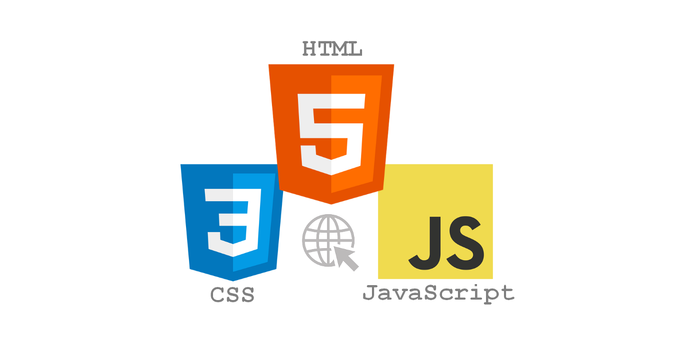
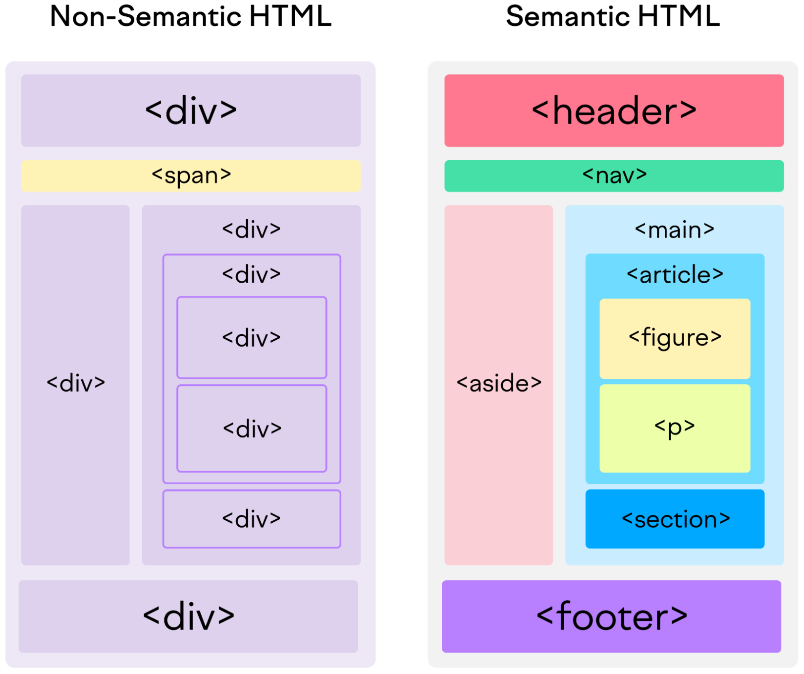

#  Tema 4. HTML i CSS

!!! quote "Leonardo da Vinci"

    La simplicidad es la máxima sofisticación.

!!! quote "Tim Berners-Lee, creador de la World Wide Web."

    La web no se trata de tecnología, se trata de conexiones.

## 4.1 Introducció a HTML

- HTML (HyperText Markup Language) és un **llenguatge de marques** que permet visualitzar documents a la **Web**.

- Consisteix en una sèrie d'elements que 'marquen' el contingut per a que aparegui d'una forma determinada.  
  Els **elements HTML** poden fer que un texte es comporti com un enllaç que ens pot connectar amb altra web, pot posar en negreta una paraula, etc.

- Hi ha més de 100 etiquetes predefinides a HTML. [HTML elements reference](https://developer.mozilla.org/en-US/docs/Web/HTML/Element).
  Els elements es poden dividir en varis **tipus**: 
    - **Estructuració del contingut** (header, footer, main, nav). Permet organitzar el contingut del document.
    - **Metadades** document (head, style, title, link). Conté informació sobre la pàgina.
    - **Semàntica** texte inline (a, abbr, br, code, strong, sub). Defineixen el significat, estructura o estil   
    d'un texte.
    - **Contingut** texte (div, hr, li, pre, quote).

- **Les etiquetes** utilitzades a HTML, com per exemple "paràgraf" (`<p>`) o "taula" (`<table>`).
  **no es mostren en el navegador**, indiquen com mostrar la informació. Per exemple per mostrar un paràgraf:

    `<p>The gulls swept over Dover.</p>`

    <p>The gulls swept over Dover.</p>

- Les **regles pels elements a HTML són equivalents a XML**: etiquetes, atributs, element arrel. Recordem 
  que HTML no és un metallenguatge i no podem inventar les nostres etiquetes. Teniu en compte que a HTML els elements normalment s'aniden (per exemple `<p>El meu gat està <strong>sempre</strong> dormint.</p>`) i que alguns elements normalmen són buits (per exemple una imagte ``).

- HTML5 es va llançar el 2014 i és la última versió del llenguatge. El desenvolupament d'HTML està a càrrec del consorci WHATWG (Web Hypertext  
  Application Technology Working Group). HTML inicialment va estar liderat pel W3C però el seu desenvolupament era molt lent (HTML 4.0 va sortir el 1997). 

- Dintre d’un document HTML podem trobar 3 llenguatges diferents: HTML, CSS i Javascript.

  

  - CSS permet donar estil (color, tamany, posisició) als elements HTML.
  - Javascript (JS) és un llenguatge de programació i permet la creació de pàgines web interactives.

- Un navegador (browser) permet visualitzar pàgines HTML. També sap interpretar CSS (per donar estil) i Javascript (per donar funcionalitat).


Estructura d’una pàgina HTML5:

```html
  <!DOCTYPE html>
  <html lang="ES">
      <head>
          <meta charset="utf-8">
          <meta name="viewport" content="width=device-width, initial-scale=1.0">
          <title></title>
          <!-- css, meta -->
      </head>
      <body>
          <h1>Això és un <b>titular</b> en HTML</h1>
          <p>Aquest és el primer paràgraf.</p>
          <!-- scripts Javascript -->
      </body>
  </html>
```

La primera linea indica que el document és un document HTML5. A continuació hem d’escriure l’element arrel (__html__) especificant l’idioma amb l’atribut lang.

L’etiqueta __head__ permet especificar algunes metadades adicionals sobre la pàgina web. Els elements que apareixen dintre de l’element __head__ no surten al navegador. Dintre podem especificar el joc de caràcters que farem servir, el títol de la web (surt a la barra del navegador) i enllaços a diferents fitxers, com scripts, estils css, etc.

L’etiqueta __body__ representa el contingut de la pàgina i tot el que afegim en aquesta part sortirà al navegador.

## 4.2. Demo

Veure annexos per Extensions recomanades.

https://code.visualstudio.com/docs/editor/emmet

Més informació:

[Element Meta (mozilla.org)](https://developer.mozilla.org/en-US/docs/Web/HTML/Element/meta)

[HTML5 template complet](https://www.sitepoint.com/a-basic-html5-template/)


## 4.3. Elements bàsics de formateig

Existeixen molts elements HTML per donar format al nostre texte. Alguns dels més utilitzats són:

* Capceleres: &lt;h1&gt;&lt;/h1&gt;
              &lt;h2&gt;&lt;/h2&gt;
               ...
              &lt;h6&gt;&lt;/h6&gt;
* Paràgraf: &lt;p&gt;&lt;/p&gt;
* Texte preformatejat: &lt;pre&gt;&lt;/pre&gt;
* Forçar salt de línia o espai: &lt;/br&gt; i &nbsp;
* Línia horizontal: &lt;hr&gt;
* Efectes de texte (negreta, èmfasi, subratllat, ratllar): &lt;strong&gt;, &lt;em&gt;, &lt;ins&gt;, &lt;del&gt;
* Resaltat de texte, subíndex, superíndex: &lt;mark&gt;&lt;sub&gt;&lt;sup&gt; H2O H&lt;sub>2&lt;/sub&gt;O

El resultat dels elements bàsics seria:

```html
<h1>Capcelera H1</h1>
<h2>Capcelera H2</h2>
<h3>Capcelera H3</h3>
<h4>Capcelera H4</h4>
<h5>Capcelera H5</h5>
<h6>Capcelera H6</h6>
```

<h1>Capcelera H1</h1>
<h2>Capcelera H2</h2>
<h3>Capcelera H3</h3>
<h4>Capcelera H4</h4>
<h5>Capcelera H5</h5>
<h6>Capcelera H6</h6>

```html
<p>Això es un paràgraf a HTML</p>
```

<p>Això es un paràgraf a HTML</p>

El texte preformatejat conserva els espais

```html
<pre>
Tu corazón, ya terciopelo ajado,
llama a un campo de almendras espumosas
mi avariciosa voz de enamorado.
</pre>
```

<pre>
Tu corazón, ya terciopelo ajado,
llama a un campo de almendras espumosas
mi avariciosa voz de enamorado.
</pre>

`Alguns efectes de texte bàsics com <strong>negreta</strong>, <em>èmfasi</em>, <ins>subratllat</ins> o <del>ratllar</del>, s'aconsegueixen amb les etiquetes strong, em, ins o del.`

Alguns efectes de texte bàsics com <strong>negreta</strong>, <em>èmfasi</em>, <ins>subratllat</ins> o <del>ratllar</del>, s'aconsegueixen amb les etiquetes strong, em, ins o del.

`Podem <mark>resaltar el texte</mark> i crear subíndex i superíndex, com a H2O => H<sub>2</sub>O`

Podem <mark>resaltar el texte</mark> i crear subíndex i superíndex, com a H2O => H<sub>2</sub>O


Més informació:

[Introduction to HTML (Mozilla.org)](https://developer.mozilla.org/es/docs/Learn/HTML/Introduction_to_HTML/)

Capítols:

* [HTML_text_fundamentals](https://developer.mozilla.org/en-US/docs/Learn/HTML/Introduction_to_HTML/HTML_text_fundamentals)
* [Advanced_text_formatting](https://developer.mozilla.org/en-US/docs/Learn/HTML/Introduction_to_HTML/Advanced_text_formatting)

## 4.4. Enllaços

Un enllaç (link) permet navegar per la web, és a dir accedir a altres llocs remots mitjançant un click.

L’element `<a>` (ancla o "anchor") fa que la web sigui navegable. 

Podem enllaçar diversos elements: 
* Un altre lloc remot.
* Un altre lloc de la mateixa pàgina.
* Una adreça de correu electrònic.

Enllaç a una url externa:
```html
<a href=”http://www.exemple.org”>texte de l’enllaç</a>
```

Enllaç dins la mateixa pàgina. Hem de crear una referència prevíament amb el paràmetre id.
```html
<h2 id="Mailing_address">Mailing address</h2>
Escriu-nos a <a href="contacts.html#Mailing_address">mailing address</a>
<a href=”#Mailing_address></a>
```

Si tenim el gestor de correu configurat, en fer click es crearà un correu electrònic amb el següent destinatari:
```html
<a href="mailto:nowhere@mozilla.org">Envia email a cap lloc</a>
```

Atributs més comuns:

* **href**: HyperText Reference
* **title**: mostra una descripció quan es pasa el ratolí per sobre
* **target**: Per defecte la pàgina enllaçada es mostra en la finestra actual del navegador. Aquest comportament es pot modificar. L'atribut admet els següents valors:
  * “__blank” obre l’enllaç en una nova finestra

Més info:

- [Creating HyperLinks (MDN)](https://developer.mozilla.org/en-US/docs/Learn/HTML/Introduction_to_HTML/Creating_hyperlinks)

## 4.5. Imatges

L'etiqueta `` es fa servir per mostrar imatges.

Sintaxi:
```html

```


* L'atribut `alt` mostra un text alternatiu en cas que no sigui possible mostrar la imatges (navegador text)
* L’amplada i l’alçada de la imatge la podem posar amb atributs a la mateixa etiqueta (px) o bé a un full
d’estils (CSS). El full d’estil té prioritat sobre els atributs de la etiqueta.

```html

  img {
    width: 800px;
    height: 900px;
  }
```

La font pot ser una subcarpeta del servidor o una URL:
```html


```

Imatge amb enllaç:
```html
<a href="https://www.w3schools.com">
   
</a>
```

L'element a admet els següents formats d’imatge:

* JPG
* PNG
* GIF (inclós GIF animat)
* BMP
* SVG (vectorial, basat en XML)

Més info:

- [Images in HTML (MDN)](https://developer.mozilla.org/en-US/docs/Learn/HTML/Multimedia_and_embedding/Images_in_HTML)
- [img The Image Embed element  (MDN)](https://developer.mozilla.org/en-US/docs/Web/HTML/Element/img)


## 4.6. Llistes

Les llistes ens permeten mostrar elements amb vinyetes per formar una llista d’elements. Les llistes poden ser ordenades, desordenades i de definició. 

1. Unordered List `<ul>`

```html
  <h3>Llista de la compra:</h3>
  <ul>
    <li>Patates</li>
    <li>Vi</li>
    <li>Pollastre</li>
  </ul>
```
2. Ordered List `<ol>`

```html
  <h3>Grups favorits:</h3>
  <ol>
    <li>Led Zeppelin</li>
    <li>Metallica</li>
    <li>Iron Maiden</li>
  </ol>
```
3. Definition List `<dl>`

```html
  <dl>
    <dd>Definició-1</dd>
    <dt>Terme-1</dt>
    <dd>Definició-2</dd>
    <dt>Terme-2</dt>
  </dl>
```

Resultat:

<h3>Llista de la compra:</h3>
<ul>
<li>Patates</li>
<li>Vi</li>
<li>Pollastre</li>
</ul>

<h3>Grups favorits:</h3>
<ol>
<li>Led Zeppelin</li>
<li>Metallica</li>
<li>Iron Maiden</li>
</ol>

Exemple de llista de definicions:

```html
<p>Termes informàtics:</p>
<dl>
  <dt>Cookie</dt>
  <dd>Un pequeño archivo de texto enviado por un sitio web
  visitado. Permite reconocer al usuario y personalizar
  la web.</dd>
  <dt>Spam</dt>
  <dd>Mensajes de correo no deseados enviados masivamente y
  generalmente por motivos comerciales.</dd>
  <dt>CAPTCHA</dt>
  <dd>Las comprobaciones CAPTCHA permiten verificar que el
  usuario de una web es un humano y no un bot o un
  proceso automatizado.</dd>
</dl>
```

<p>Termes informàtics:</p>
<dl>
<dt>Cookie</dt>
<dd>Un pequeño archivo de texto enviado por un sitio web
visitado. Permite reconocer al usuario y personalizar
la web.</dd>
<dt>Spam</dt>
<dd>Mensajes de correo no deseados enviados masivamente y
generalmente por motivos comerciales.</dd>
<dt>CAPTCHA</dt>
<dd>Las comprobaciones CAPTCHA permiten verificar que el
usuario de una web es un humano y no un bot o un
proceso automatizado.</dd>
</dl>


L’estil de les vinyetes de les llistes es pot canviar amb CSS! 

```css
  ul {
  list-style-type: none;
  }
```
Diferents propietats CSS (estil), que podem canviar de les llistes:

- [CSS Lists (w3schools)](https://www.w3schools.com/css/css_list.asp)

Més informació sobre llistes:

- [Styling lists (MDN)](https://developer.mozilla.org/en-US/docs/Learn/CSS/Styling_text/Styling_lists)


## 4.7. Taules. Estructura bàsica.

Les taules ens permeten mostrar la informació en files i columnes. El posicionament dels elements a la pàgina no es fa mitjançant taules. Actualment hi ha altres tècniques amb CSS per a posicionament d’elements, tal com veurem més endavant en aquest capítol

Un exemple bàsic:

```html
  <table>
    <thead>
      <tr>
        <th>capcelera1</th>
      <th>capcelera2</th>
      </tr>
    </thead>
    <tbody>
      <tr> <!-- table row -->
      <td>fila1 col1</td>
      <td>fila1 col2</td>
      </tr>
    </tbody>
  </table>
```

Sortida:

  <table>
    <thead>
      <tr>
        <th>capcelera1</th>
      <th>capcelera2</th>
      </tr>
    </thead>
    <tbody>
      <tr> <!-- table row -->
      <td>fila1 col1</td>
      <td>fila1 col2</td>
      </tr>
    </tbody>
  </table>

| element taula | significat |
|-------------|----------|
| table       | contenidor principal taula
| thead       | contenidor per a la linea de capcelera (negreta) 
| tr          | identifica l'inici d'una nova fila
| th          | marca cada camp de la capcelera. Equivalent a td
| tbody       | contenidor per al contingut principal de la taula
| td          | contenidor per a la cel.la de dades
| tfoot       | contenidor per al peu de la taula (per exemple per a calcular subtotals)


1. Definirem cada fila de la nostra taula amb l'etiqueta `<tr>`, excepte la fila de capcelera que fem servir `<th>`, que té un format diferent de la resta (negreta).
2. Dintre de cada fila, les columnes s'identifiquen amb l'etiqueta `<td>`.
3. Els elements <td> poden contenir tot tipus d’elements HTML: text, imatges, llistes, altres taules, ...
4. Per últim també tenim l’etiqueta __tfoot__ per afegir un peu de taula, per exemple per sumaritzar alguna de les columnes.

A les taules li podem aplicar diferents propietats CSS aquí les podeu consultar

- [Styling tables (MDN)](https://developer.mozilla.org/en-US/docs/Learn/CSS/Building_blocks/Styling_tables)

### Propietats CSS:
- `width` i `height`: ens permet donar l’amplada a la taula o a les columnes i l’alçada de cada fila. Si volem que ocupi tot l’ample farem servir el valor 100%

- `order`: ens permet especificar les línies que separen cada cel.la. Si li volem aplicar a tota la taula, li aplicarem a les etiquetes: table, th, td
- `border-collapse`: quan posem border a una taula i les seves cel.les es crea una línia doble que podem treure amb aquesta propietat amb el valor collapse.

Més info:

- [HTML table basics MDN](https://developer.mozilla.org/en-US/docs/Learn/HTML/Tables/Basics)
- [HTML table advanced features and accessibility MDN](https://developer.mozilla.org/en-US/docs/Learn/HTML/Tables/Advanced)


## 4.8. Formularis

Els formularis són un dels elements HTML més complexos. Permeten recollir dades de l’usuari amb la incorporació de controls (input, radio button, dropdown, botons,
etc. Amb l’ajuda d’un llenguatge de servidor (PHP, NodeJS) podem guardar-ho en una base de dades. L’esquema bàsic per a un formulari seria:

```html
  <form action=”gestio-form.php” method=”post”>
    <label for=”name”>Nom</label>
    <input type=”text” id=”name”>
    ...
    <input type=””>
    <button type=”submit”>Submit</button>
  </form>
```

Els tipus d’elements que podem incloure en un formulari són:


|Element                                                           | Significat                                                       |
|------------------------------------------------------------------|-----------------------------------------------------------------|
| &lt;label for=”id_input”&gt;Texte&lt;/label&gt;                              | Etiqueta per a camp texte                                       |
| &lt;input type=”text”&gt;                                              | Camp de texte                                                   |
| &lt;input type=”email”&gt;                                             | Valida email: usuari@domini                                     |
| &lt;textarea&gt;...&lt;/textarea&gt;                                         | Área de texte major que input                                   |
| &lt;button type=”submit”&gt;&lt;/button&gt;                                  | Envía el formulari al servidor                                  |  
| &lt;fieldset&gt;&lt;legend&gt;&lt;/legend&gt;&lt;/fieldset&gt;                           | Dibuixa un marc amb títol dels camps                            |
| &lt;input type=”radio”&gt;                                             | Radio button                                                    |
| &lt;input type=”checkbox”&gt;                                          | Checkbox                                                        |
| &lt;input type=”date”&gt;                                              | Control amb selector de data                                    |
| &lt;input type=”file”&gt;                                              | Control amb selector de arxius                                  |
| &lt;select&gt;&lt;option selected=”selected”&gt;O1&lt;/option&gt; &lt;option&gt;On&lt;/option&gt;&lt;/select&gt;  | Desplegable amb opcions predefinides. Atribut selected opcional.
|&lt;input type=”tel”&gt; / type=”URL”&gt; / type=”numeric”&gt;                | Input amb validació                                                |
| &lt;input type="range" name="price" id="price" min="50000" max="500000" step="100" value="250000"&gt;  | Crea un slider (control per filtrar preu màxim)                     |
| &lt;meter min="0" max="100" value="75" low="33" high="66" optimum="50"&gt;75&lt;/meter&gt; | Control meter                                         |
| &lt;input type=”submit” / “reset” / “button”&gt;                       | Envia al servidor / neteja formulari /personalitzable amb Javascipt |

Més info:

- [Forms (Mozilla.org)](https://developer.mozilla.org/en-US/docs/Learn/Forms)
- [Element FORM: Mètode GET vs POST](https://developer.mozilla.org/en-US/docs/Learn/Forms/Sending_and_retrieving_form_data)

## 4.9. Altres elements: video, audio, pictures

HTML5 incorporta elements nous com &lt;video&gt;, que permet inserir un video dins
una pàgina web. Youtube i altres plataformes de video fan servir aquest element.
Alguns elements propis de HTML5:

video, audio, figure i iframe

```xml
<div>
  <svg height="300" width="800">
    <defs>
      <linearGradient id="grad1" x1="0%" y1="0%" x2="100%" y2="0%">
        <stop offset="0%" style="stop-color:rgb(255,255,0);stop-opacity:1" />
        <stop offset="100%" style="stop-color:rgb(255,0,0);stop-opacity:1" />
      </linearGradient>
    </defs>
    <rect x="50" y="20" rx="20" ry="20" width="600" height="100" fill="url(#grad1)" style="fill:blue;stroke:darkblue;stroke-width:5;opacity:0.6" />
    <ellipse cx="100" cy="70" rx="85" ry="55" fill="url(#grad1)" /> 
    <text fill="#ffffff" font-size="45" font-family="Verdana" x="50" y="86">&nbsp;Pagina Web Multimedia</text>
    Sorry, your browser does not support inline SVG.
  </svg>    
</div>

<div>
<!-- HTML compatible video formats: mp4 webm ogg https://es.wikipedia.org/wiki/WebM -->
    <video width="320" height="240" controls
            autoplay>
    <source src ="tierra_noche_MP4_480_1_5MG.mp4">
  </video>
</div>    

<div>
<video width="320" height="240" controls autoplay loop> 
  <source src ="./vid/escena_animacion.mp4">
  <track src="./vid/escena_animacion.srt" label="Ingles SRT" kind="subtitles" srclang="en">
  <track src="./vid/escena_animacion.vtt" label="Ingles" kind="subtitles" srclang="en" default>
  Video tag not supported. Download the video 
  <a href="./vid/escena_animacion.mp4">here</a>.
</video>
</div>

<div>
<audio controls autoplay>
  <source src="./vid/viper.mp3" type="audio/mp3">
  <source src="./vid/viper.ogg" type="audio/ogg">
  <p>Your browser doesn't support HTML5 audio. Here is a <a href="viper.mp3">link to the audio</a> instead.</p>
</audio>
</div>

<figure>
    
    <figcaption>Foto aleatoria de picsum</figcaption>
</figure>

<div>
    <iframe width="800" height="600" src="https://es.wikipedia.org/wiki/Rage_Against_the_Machine" 
    title="Wikipedia Rage_Against_the_Machine" frameborder="0" 
    allow="accelerometer; autoplay; clipboard-write; encrypted-media; gyroscope; picture-in-picture" allowfullscreen></iframe>
  </iframe>
</div>

<div>
    <iframe src="https://www.google.com/maps/embed?pb=!1m14!1m12!1m3!1d5918.938391083444!2d2.762264678464291!3d42.118837724998826!2m3!1f0!2f0!3f0!3m2!1i1024!2i768!4f13.1!5e0!3m2!1ses!2ses!4v1638391807509!5m2!1ses!2ses" 
    width="800" height="600" style="border:0;" allowfullscreen="" loading="lazy">
  </iframe>  
</div>
```

Descarregar arxius:

- [escena_animacion.mp4](assets/vid/escena_animacion.mp4)
- [escena_animacion.vtt](assets/vid/escena_animacion.vtt)
- [viper.mp3](assets/vid/viper.mp3)


## 4.10. HTML5: tags semàntics i contenidor

Elements **NO semàntics**: `<div>` i `<span>`. Aquests contenidors no aporten informació sobre el contingut. 

HTML5 incorpora uns 100 tags semàntics. 
Per ex: &lt;nav&gt; per incloure una barra de navegació.

```html
  <article>
  <aside>
  <footer>
  <header>
  <section>
  <details>
  <summary>
  <main>
  <time>
```



- [HTML5 semantic elements](https://www.w3schools.com/html/html5_semantic_elements.asp)
- [Document and website structure MDN](https://developer.mozilla.org/en-US/docs/Learn/HTML/Introduction_to_HTML/Document_and_website_structure)

## 4.11. Estils

De moment hem vist elements HTML que permeten organitzar la informació mostrada. També podem aplicar estils a cadascun dels elements individualment. Per això fem servir el llenguatge CSS. La sintaxi es:

```xml
  <element style=”propietat:valor;”>
```
Per exemple, per establir el color de fons del cos de la web, fariem:

```html
<body style="background-color:powderblue;"> (nom del color o en hexadecimal)
```

Per cambiar el color del text:

```html
<h1 style="color:blue;">This is a heading</h1>
<p style="color:red;">This is a paragraph.</p>
```

Per cambiar familia de la font:

```html
<h1 style="font-family:verdana;">This is a heading</h1>
<p style="font-family:courier;">This is a paragraph.</p>
```

## 4.12. CSS

CSS o Cascading Style Sheet, és un llenguatge per donar estil i presentar l’HTML. Mentre que el HTML conté el significat o contingut, CSS és la presentació del document. Els fulls d’estil no s’assemblen a HTML. El format per definir un element CSS és propietat:valor, on la propietat pot ser qualsevol característica del texte: color, tipus I tamany les fonts, posició de l’element, etc.

## 4.13. Com aplicar codi CSS a HTML?

Fins ara quan hem desenvolupat una pàgina Web, ho hem fet amb etiquetes agrupades en un sol fitxer, el qual incloïa tant el contingut web (text, imatges, taules...) com el seu format (color i mida de la lletra, imatges de fons...).

Això comporta uns problemes:
* Els llocs web tenen normalment més d’una pagina. Si volem canviar l’estil ho hem de fer a cadascuna de les pàgines.
* Les modificaciones sobre un lloc web acostumen a ser sobre el contingut, mantenint el format estàtic. Separar contingut i estil facilita el manteniment.

Tenim el següent codi CSS que canvia els encapçalaments tipus h1, posant el text de color vermell i la mida de la lletra a 20 píxels:

```css
  h1 {
    color: #ff0000;
    font-size: 20px;
  }
```

  Sintaxi:

```css
  element_html {
    propietat: valor;
    propietat: valor;
  }
```

Aquest format s’aplicarà a tots els elements h1 del web. Podem definir tantes regles com necessitem. Fins i tot, podem definir-ne diverses per a un mateix element (el resultat serà la suma de les regles).

Tenim tres formes d’aplicar CSS a HTML: inline, interna I externa:

* A l’HTML, dins de l’etiqueta (inline):

```html
<h1 style="color:#ff0000;background-color:#ffff00">
```

  Si una etiqueta ja té un estil predefinit (com és el cas de h1), el que estem fent és redefinir-lo. Només s’aplica a l’etiqueta en qüestió (no a totes!).

* A la capcelera de la pàgina web (interna). Dintre de l’element &lt;head&lt;, afegim les etiquetes &lt;style&lt; ... &lt;/style&lt;. Afecta a tots els elements del document.

```html
  <!DOCTYPE html>
  <html>
        <head>
        <title>Ejemplo de estilo a nivel global</title>
        <style>
              h1 {
                color:#ff0000;
                background-color:#ffff00;
              }
        </style>
      </head>
      <body>
        <h1>Primer t&iacute;tol</h1>
        <h1>Segundo t&iacute;tol</h1>
      </body>
  </html>
```

* En un fitxer extern. Al head, afegint l’etiqueta link amb la ubicació de l’arxiu (a href). Per defecte farem servir aquest mètode, permet tenir el codi separat i mantenir-lo més fàcilment:

```html
  <!DOCTYPE html>
  <html>
    <head>
      <title>Ejemplo de estilo a nivel global</title>
      <link rel="StyleSheet" href="estils.css" type="text/css">
    </head>
    <body>
      <h1>Primer t&iacute;tol</h1>
      <h1>Segundo t&iacute;tol</h1>
    </body>
  </html>
```

Pot ser que apliquem estils de les 3 formes diferents en el mateix document. En aquest cas, s’aplicarà seguint el següent ordre de prioritat (1 més prioritari, 3 menys):

1. Element
2. A la pàgina
3. Fitxer extern

## 4.14. Selectors, propietats, valors.

Mentre que a HTML tenim elements, a CSS tenim selectors. La major part d’elements HTML existeixen com a selectors, encara que CSS té selectors amb funcions avançades que no existeixen a HTML.

Exemple:

```html
body {
  font-size: 14px;
  color: navy;
}
```

Pel selector body (tota la pàgina), existeixen les propietats font-size i color dintre del símbols { } que canviaran el color de fons a navy I el tamany de la font a 14px, Apart de la unitat pixels (px), podem utilitzar altres: cm, mm, %, em, rem. Alguns colors estan predefinits però també es poden especificar de moltes formes:

red
rgb(255,0,0)
rgb(100%,0%,0%)
#ff0000 (Hexadecimal)

Les propietats estan definides prèviament I no totes les propietats es poden aplicar a tots els elements. Aquí podeu trobar un llistat de totes les propietats:
https://www.w3schools.com/cssref/

Apart dels selectors d’HTML, a CSS també podem crear els nostres propis selectors. Si tenim els següent codi HTML:

```html
  <body>
    <p>Lorem ipsum dolor sit amet...</p>
    <p>Nunc sed lacus et est adipiscing accumsan...</p>
    <p>Class aptent taciti sociosqu ad litora...</p>
  </body>
```

Com podem aplicar un estil únicament a un des paràgrafs (per exemple, al primer)? Utilitzant els selectors de classe o els selectors d’ID

## 4.15. Selecció per classe

El selector per classe és un nom precedit per un punt (“.”). Afectarà a tots els elements de la mateixa classe:

CSS:

```css
  .p_vermell {
    color: red;
  }
```

HTML:

```html
<body>
  <p class="p_vermell">Lorem ipsum dolor sit amet...</p>
  <p>Nunc sed lacus et <a href="#" class="p_vermell">est adipiscing</a>
  accumsan...</p>
  <p>Class aptent taciti <em class="p_vermell">sociosqu ad</em>
  litora...</p>
</body>
```

Formes avançades de selecció:

Potser volem únicament que s’apliqui als &lt;p&gt; que tinguin definida la classe:

```css
  p.p_vermell {
    color: red;
  }
```

O aquells que siguin de la classe, i que siguin fills de &lt;p&gt;:

```css
  p .p_vermell {
    color: red;
  }
```

O a tots els elements &lt;p&gt; i els elements que siguin de la classe:

```css
  p, .p_vermell {
    color: red;
  }
```

## 4.16. Selecció per ID

El selector per classe és un nom precedit per un caràcter coixinet (“#”). Afectarà només a l’element que contingui aquell ID. NO ES POT REPETIR UN ID AL MATEIX DOCUMENT.
El funcionament és similar al concepte classe:

```html
  <body>
    <p>Lorem ipsum dolor sit amet...</p>
    <p id=”destacat”>Nunc sed lacus et est adipiscing accumsan...</p>
    <p>Class aptent taciti sociosqu ad litora...</p>
  </body>
```

CSS:
```css
  #destacat {
    color: red;
  }
```

## 4.17. Selectors pseudoclasses

Els pseudoselectors serveixen per a aplicar un estil a un element HTML que es trobi en un estat concret. És molt útil amb els elements del tipus hipervincle: <a>

Sintaxi:
```css
selector:pseudo_classe {
  propietat: valor;
}
```

Possibles estats dels enllaços (`<a href="">`):

* Sense visitar - link
* Visitat - visited
* El ratolí sobre l’enllaç, però sense fer click - hover
* Amb el focus sobre l’enllaç - active

Han d’estar definides seguint aquest ordre (no cal definir-les totes, però si en ordre).

Exemple:
```css
a:visited {
  color: red;
}
```

[HTMLDog Guides](https://htmldog.com/guides/)

## Crèdits

Aquest text conté material pres d'una presentació de **Toni Ruiz**, utilitzat sota els termes de la **GNU Free Documentation License**.

### Licència

Copyright (C) Toni Ruiz  
Permission is granted to copy, distribute and/or modify this document under the terms of the GNU Free Documentation License, Version 1.3 or any later version published by the Free Software Foundation; with no Invariant Sections, no Front-Cover Texts, and no Back-Cover Texts.  
A copy of the license is available at [http://www.gnu.org/licenses/fdl.txt](http://www.gnu.org/licenses/fdl.txt).


Aquest document està llicenciat sota els termes de la [Licencia Creative Commons Attribution 4.0 International (CC BY 4.0)](LICENSE.md).