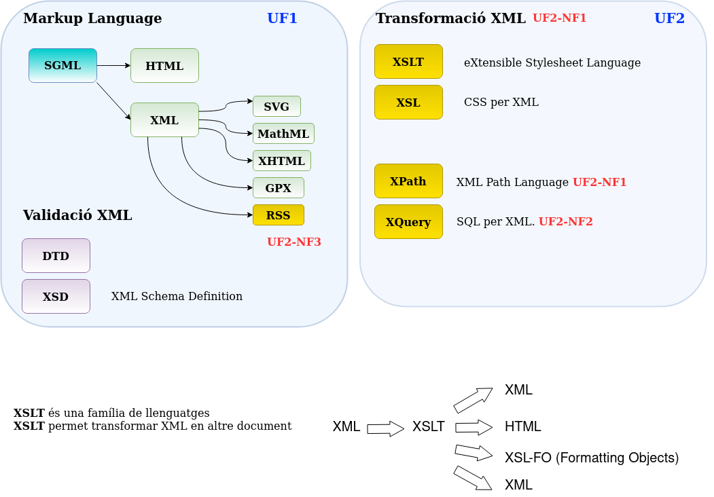
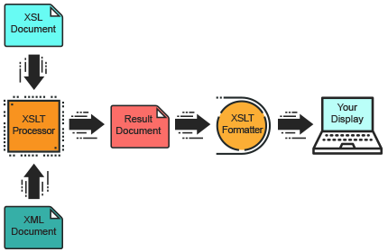

# Tema 5. Transformació de documents XML (XSLT)
## 5.0 Resums UF2



## 5.1 Introducció a XSLT

En capítols anteriors hem vist que XML és un format relativament llegible, doncs es tracta de fitxers de texte pla i la informació està organitzada jeràrquicament. No obstant, com hem vist darrerament amb HTML, als humans els agrada visualitzar la informació col.locada en determinats formats que facin la lectura més agradable, com l'al.lineació, format del texte o els colors. 

Donat que XML està pensat principalment per emmagatzemar i intercanviar informació, si volem representar-les d'una altra manera, tindrem diverses possibilitats:

* Desenvolupar un programa que agafi les dades XML i generi la sortida en el format que volem. En aquest cas tenim l'inconvenient que hem de tenir coneixements de programació.

* Utilizar CSS, que com hem vist permet canviar la visualització de les dades d'un document HTML a la web. CSS permet canviar la visualització de les dades, però no transformar els documents com veurem en aquesta unitat.

* Transformar el document. Aquesta opció permet transformar el document en un altre pensat per a la seva visualització: PDF, HTML, etc.

## 5.2 XSLT (Extensible Stylesheet Language Transformations)

XSLT és una familia de llenguatges basats en XML que permeten transformar els documents XML en altres documents. Consta del següents llenguatges:

* XSL (eXtensible Stylesheet Language) és un llenguatge per transformar documents XML en altres documents com HTML, XML o texte pla.

* XPath és un llenguatge que permet accedir a parts concretes d'un document XML mitjançant expressions de búsqueda. Permet navegar per un document XML.

* XSL-FO (XSL formatting objects) permet definir format als documents XML, tant per a formats de pantalla com per a formats paginats. Permet la creació de documents PDF.

En aquest capitol ens centrarem bàsicament en la transformació de documents mitjantçant XSLT, que permet crear, a partir d'un document XML altres documents com XML, HTML o texte.

## 5.3 Fulls d'estil: CSS vs XSLT

L'organisme W3C ha definit dues families de normes per als fulls d'estil. La més sencilla es CSS, que ja hem vist al capítol dedicat a HTML. CSS té les següents limitacions, que es solucionen amb XSLT:

* Amb CSS no podem canviar l'ordre dels elements que surten en un document HTML, no es poden ordenar els elements o filtrar per algun criteri (tal com fariem a la clàusula WHERE de SQL).

* Amb CSS no podem realitzar operacions amb els elements, per exemple calcular els valors de tots els elements &lt;preu&gt; d'un document XML.

També podem combinar els dos llenguatges, CSS per donar estil al document i XSLT per fer transformacions sobre ell. A continuació tenim un exemple de XML i CSS. 

Exercici: copia els següents codis en dos fitxers de texte i intenta mostrar-los en un navegador.

Document alumnes.xml

```xml
<?xml version="1.0" encoding="UTF-8"?>
<?xml-stylesheet type="text/css" href="estil.css"?>
    <alumne>
        <nom>Marc</nom>
        <cognom>Màrquez</cognom>
    </alumne>
    <alumne>
        <nom>Fernando</nom>
        <cognom>Alonso</cognom>
    </alumne>
    <alumne>
        <nom>Pau</nom>
        <cognom>Gasol</cognom>
    </alumne>    
```

Document estil.css

```css
alumne {
    text-align: center;
}
nom {
    font-weight: bold;
    font-family: tahoma;
    color: blue;
}
cognom {
    color: cyan;
}
```

## 5.4 Versions de XSLT

XSLT està inspirat en DSSSL, l'equivalent a XSLT en l'antic SGML. Actualment (2022), tenim tres versions:

* **XSLT 1.0.** 1999. Desenvolupat pel W3C, juntament es va desenvolupar XSL-FO i XPath. Encara es fa servir bastant (2018) doncs és el més compatible amb els navegadors.

* **XSLT 2.0.** 2007. Desenvolupat per Michael Kay, també desenvolupador de XQuery y Saxon XSLT. Com a novetats permet crear múltiples documents de sortida

* **XSLT 3.0.** 2017. Millores per a la transformació de documents XML molt grans.


## 5.4 Processadors XSLT

Un processador XSLT permet llegir un document XSL i a partir de les regles de transformació sobre un document XML, permet generar un altre document formatejat tipus XML, HTML o texte.



El seu ús implica necessàriament els següents passos:

1. Tenir un document XML ben definit (sintàcticament). 
2. Validar el document mitjançant DTD o XML Schema (XSD).
3. Crear un full d'estil XSL ben format (ha de seguir les regles XML). (veure apartat 5.4.1)
4. Vincular el document XML amb el full d'estil XSL. (veure apartat 5.4.2)
5. Executar la tranformació amb el processador XSLT.

El processador XSLT va llegint el document XML, processant node a node el XML i aplicant les transformacions necessàries definidas a les __templates rules__ del full XSLT. Els __templates__ són un conjunt de regles que s'apliquen quan es troben els nodes especificats. El llenguatge que s'utilitza per navegar pels nodes del document XML és XPath.

Podem treballar amb processadors off-line amb editors com __XML Copy Editor__, __Visual Studio Code__ (requereix d'un programa extern apart d'una extensió) processadors en línia com.

**Processadors XSLT on-line:**

* [XSL Transformation (XSLT) Online Toolz](https://www.online-toolz.com/tools/xslt-transformation.php "XSLT Transformation Online Tool")

* [Free Online XSLT Transformer](https://www.freeformatter.com/xsl-transformer.html "Free Formatter")

**Processadors off-line:**

* [XSLT Saxon Processor](https://saxon.sourceforge.net/ "XSLT Saxon Processor"). Està basat en Java, per tant cal tenir insta.lat el JRE (inclòs en el JDK). És el que farem servir en aquesta UF. Veure Annex 1.

* [Xalan](https://xml.apache.org/xalan-j/). Només suporta XSLT 1.0. També està basat en Java però el seu desenvolupament està estancat.

### 5.4.1. Crear full d'estil ben format

La declaració d'un document XSL és la següent (són equivalents, normalment es fa servir **xsl:stylesheet**):

```xml
<?xml version=“1.0” encoding=“UTF-8”?>
<xsl:stylesheet version="1.0" xmlns:xsl="http://www.w3.org/1999/XSL/Transform">
    ...
</xsl:stylesheet>
```

 o

```xml
<?xml version=“1.0” encoding=“UTF-8”?>
<xsl:transform version="1.0" xmlns:xsl="http://www.w3.org/1999/XSL/Transform"> 
    ...
</xsl:transform>
```

### 5.4.2 Vincular un XSL al document XML

Per vincular el document XSL al document XML, afegim la següent Processing Instruction (PI) al XML:

```xml
<?xml version=“1.0” encoding=“UTF-8”?>
<?xml-stylesheet type=“text/xsl” href=“catalog.xsl”?>
```

## 5.5 Creació de templates

### **Document d'exemple**

Aquest és el document XML que farem servir per a la creació de plantilles:

```xml
<?xml version="1.0" encoding="UTF-8"?>
<persones>
  <persona naixement="1912" mort="1954">
    <nom>
      <primer_nom>Alan</primer_nom>
      <cognom>Turing</cognom>
    </nom>
    <profesio>informàtic</profesio>
    <profesio>matemàtic</profesio>
    <profesio>criptògraf</profesio>
  </persona>
  <persona naixement="1903" mort="1957">
    <nom>
      <primer_nom>John</primer_nom>
      <inicial_segon_nom>V</inicial_segon_nom>
      <cognom>Neumann</cognom>
    </nom>
    <profesio>matematic</profesio>
    <hobby>jugar a tenis</hobby>
  </persona>
</persones>
```

Dintre del document XSL afegirem un template o regles de plantilla per indicar quina sortida volem a partir de l'entrada seleccionada. L'element **xsl:template** té dues parts:

* L'atribut **match** que conté un patró que coincideix amb un o més nodes del document XML. Aquest patró está especificat en el llenguatge XPath. En aquest cas el símbol "/" indica l'arrel del document XML. Fixeu-vos que la sintaxi s'assembla deliveradament amb les rutes d'arxius del sistema operatiu Unix/Linux.

* Tot el contingut que escrivim dintre del template es transmet a la sortirda. Aquesta plantilla pot contenir part d'un document html, xml o caràcters de texte. Dintre d'aquest contingut també inclourem els elements xsl que permetran obtenir informació dels nodes XML i incoporar-la al contingut existent en la plantilla.

```xml
<?xml version=“1.0” encoding=“UTF-8”?>
<xsl:stylesheet version="1.0" xmlns:xsl="http://www.w3.org/1999/XSL/Transform">
    <xsl:template match="/">
        <html>
            <body>
                <h2>Personatges històrics de la informàtica</h2>
                <!-- Aqui podem seleccionar elements XML i inserir-los al nostre HTML-->
            </body>
        </html>
    </xsl:template>
</xsl:stylesheet>
```

La coincidència de patró més sencilla és el nom d'un element. Si per exemple fem coincidir l'element **persona**, el següent exemple simplement escriu el texte ___Una persona___:

```xml
<?xml version="1.0"?>
<xsl:stylesheet version="1.0" xmlns:xsl="http://www.w3.org/1999/XSL/Transform">
     
  <xsl:template match="persona">Una Persona</xsl:template>
     
</xsl:stylesheet>
```

Hi ha dos elements coincidents anomenats persona, i cada vegada que el processador troba aquest element simplement escriu ```una persona```:

```xml
<?xml version="1.0" encoding="utf-8"?>
     
 Una Persona
     
 Una Persona
```

Una persona és texte pla, però també podem escriure elements de llenguatges de marques, com en l'exemple següent. L'única restricció és que com XSLT és un document XML ben format, el llenguatge de marques de sortida també ha d'estar ben format:

```xml
<?xml version="1.0"?>
<xsl:stylesheet version="1.0" xmlns:xsl="http://www.w3.org/1999/XSL/Transform">
     
  <xsl:template match="persona"><p>Una Persona</p></xsl:template>
     
</xsl:stylesheet>
```
Dona com a resultat:

```xml
<?xml version="1.0" encoding="utf-8"?>
     
  <p>Una Person</p>
     
  <p>Una Persona</p>
```

La majoria de les vegades, el que farem serà seleccionar elements del document d'entrada e inserir-los en el document de sortida. Un dels elements XSL més utilitzats es **xsl:value-of**, que obté el valor de texte del element del document XML origen. L'element que s'obté es selecciona amb l'atribut **select**, i l'atribut també conté una expressió XPath. Per escriure el nom de la persona fariem:

```xml
<?xml version="1.0"?>
<xsl:stylesheet version="1.0"
                xmlns:xsl="http://www.w3.org/1999/XSL/Transform">
     
  <xsl:template match="persona">
    <p>
      <xsl:value-of select="nom"/>
    </p>
  </xsl:template>
</xsl:stylesheet>
```

```xml
<?xml version="1.0" encoding="utf-8"?>
<p>
    Alan
    Turing
</p>
    
<p>
    John
    V
    Neumann
</p>
```

#### 5.5.1 Selecció d'atributs a XSLT

Per seleccionar atributs del document origen, fem servir el símbol **@** a l'expressió XPath dintre de l'element que volem seleccionar. Tenint en compte el document anterior, tenim el següent full XSLT:

```xml
<?xml version="1.0"?>
<xsl:stylesheet version="1.0"
                xmlns:xsl="http://www.w3.org/1999/XSL/Transform">
     
  <xsl:template match="persones">
    <html>
      <head>
        <title>Personatges històrics de la informàtica</title>
      </head>
      <body>
        <table>
          <tr>
            <td><xsl:value-of match="persona/nom"/></td>
            <td><xsl:value-of match="persona/@naixement"/></td>
            <td><xsl:value-of match="persona/@mort"/></td>
         </tr>
        </table>
      </body>
    </html>
  </xsl:template>
</xsl:stylesheet>  
  
```
El resultat seria el següent:

```html
 <html>
      <head>
        <title>Personatges històrics de la informàtica</title>
      </head>
      <body>
        <table>
          <tr>
            <td>Alan Turing</td>
            <td>1912</td>
            <td>1954</td>
         </tr>
        </table>
      </body>
    </html>
```

## 5.6 Elements de plantilles més comuns.

Dintre de les nostres plantilles XSL podem utilitzar les següents instruccions de plantilla. Pertanyen al vocabulari XSLT definit a l'espai de noms XSL.

Els més utilitzats són:

## **xsl:value-of**. 

Inserta el valor d'un element o atribut XML a la sortida resultant. Podem fer servir l'atribut select per seleccionar l'atribut o subelement el valor del qual s'utilitzarà.

**Exercici**: copia els següents codis en dos fitxers de texte i fes la transformació amb el processador on-line. Respon a la següent pregunta: 
Quants discs aparèixen al fitxer html?

```xml
<?xml version="1.0" encoding="UTF-8"?>
<catalog>
    <cd>
        <title>Empire Burlesque</title>
        <artist>Bob Dylan</artist>
        <company>Columbia</company>
        <price>10.90</price>
        <year>1985</year>
    </cd>
    <cd>
        <title>Hide your heart</title>
        <artist>Bonnie Tyler</artist>
        <company>CBS Records</company>
        <price>9.90</price>
        <year>1988</year>
    </cd>
</catalog>
```

```xml
<?xml version="1.0" encoding="UTF-8"?>
<xsl:stylesheet version="1.0" xmlns:xsl="http://www.w3.org/1999/XSL/Transform">
<xsl:template match="/">
  <html>
  <body>
    <h2>My CD Collection</h2>
    <table border="1">
      <tr bgcolor="#9acd32">
        <th>Title</th>
        <th>Artist</th>
      </tr>
      <tr>
        <td><xsl:value-of select="catalog/cd/title"/></td>
        <td><xsl:value-of select="catalog/cd/artist"/></td>
      </tr>
    </table>
  </body>
  </html>
</xsl:template>
</xsl:stylesheet>
```

[enlace w3c]: <> (https://www.w3schools.com/xml/tryxslt.asp?xmlfile=cdcatalog&amp;xsltfile=cdcatalog_ex1)

##  **xsl:for-each**. 
Es fa servir per a recórrer els elements d'un document i realitzar una sèrie d'operacions amb els nodes. L'atribut select determina els elements que s'ha de recórrer. És equivalent a l'instrucció foreach dels llenguatges de programació.

La seva sintaxi es:

```xml
<xsl:for-each select="condicio">
    <xsl:value-of select="..."/>
</xsl:for-each>
```

Exercici: modifiqueu l'exercici anterior per mostrar tots els albums:

```xml
<xsl:for-each select="catalog/cd">
    <xsl:value-of select="title"/>
    <xsl:value-of select="artist"/>
</xsl:for-each>
```

## **xsl:if**. 
Podem sel.leccionar la informació que mostrarà per pantalla en funció de les condicions que li indiquem. 

Exemple:

```xml
<xsl:if test="price&lt;=10 and Artist='Xavier Camunyes'">
```

Compte amb les cometes simples si el que volem és comparar cadenes. En la següent taula es resumeixen els símbols utilitzats per als operadors booleans:

| Símbol        | Operador      | 
| :------------ | :------------ | 
| =             | Igual         | 
| !=            | Distint       | 
| &lt;          | menor que     | 
| &gt;          | major que     | 
| &lt; =        | menor o igual que     | 
| &gt; =        | major o igual que     | 
| and           | I lògic (&amp;&amp;)     | 
| or           | O lògic (&#124;&#124;)     | 

* **xsl:sort**. Ens permet ordenar la informació en funció del contingut d'un element. Té més opcions que la clàusula ORDER BY a SQL.

La seva sintaxi seria:

```xml
<xsl:sort select="condició"/>
```

**Compte: xsl:sort no té etiqueta de tancament** 

Els atributs (opcions) que té es mostren a la següent taula:

| Atribut       |  Valor            | Significat    |
| ------------- | -------------     | ------------- | 
| select        | XPath Expression  | Especifica quin node o conjunt de nodes ordenar |
| lang          | language-code     | Especifica quin llenguatge s'utilitza per a l'ordenació |
| datatype      | text, number, qname | Especifica el tipus de dada que s'ordenarà. Per defecte és "texte" |
| order         | ascending, descending | Especifica el tipus d'ordre. Per defecte es "ascending" |
| caseorder     | upper-first, lower-first | Especifica si les lletres majúscules o minúscules s'ordenen en primer lloc |

Exemple:

```xml
<xsl:for-each select="catalog/cd">
    <xsl:sort select="artist" order="descending"/>
    <tr>
        <td><xsl:value-of select="title"/></td>
        <td><xsl:value-of select="artist"/></td>
    </tr>
</xsl:for-each>
```

## **xsl:choose**. 
Element per a condicionar els resultats que permet establir múltiples condicions dintre del recorregut de l'arbre XML. És equivalent a l'instrucció **switch-case-default** dels llenguatges de programacio.

La seva sintaxi seria:

```xml
<xsl:choose>
    <xsl:when test="expressio_1">
        tractament de les dades
    </xsl:when>
    <xsl:when test="expressio_2">
        tractament de les dades
    </xsl:when>
    ...
    <xsl:otherwise>
        tractament de les dades
    </xsl:otherwise>        
</xsl:choose>
```

Exemple:
```xml
<xsl:for-each select="catalog/cd">
    <tr>
        <td><xsl:value-of select="title"/></td>

        <xsl:choose>
            <xsl:when test="price &amps;gt; 10">
                <td bgcolor="#ff00ff"><xsl:value-of select="artist"/></td>
            </xsl:when>

            <xsl:otherwise test="price &amps;gt; 10">
                <td><xsl:value-of select="artist"/></td>
            </xsl:otherwise>
        </xsl:choose>
    </tr>
</xsl:for-each>
```

* **xsl:output**. L'element output defineix el format de sortida del document XSL (XML, HTML o texte). És un element de nivell superior, per tant ha d'anar just sota l'element xsl:stylesheet o xsl:transform. Si no especifiquem aquest element, per defecte XSLT enten que estem creant un arxiu HTML. Per exemple, el següent codi produeix un document XML com a sortida. Veure apartat 5.6 (transformació XML a XML)

```xml
<?xml version="1.0" encoding="UTF-8"?>
<xsl:stylesheet version="1.0" xmlns:xsl="http://www.w3.org/1999/XSL/Transform">
    <xsl:output method="xml" version="1.0" encoding="UTF-8" indent="yes"/>
    ...
    ...
</xsl:stylesheet> 
```

## **xsl:include**. 
L'element include també és un element de nivell superior que inclou els continguts d'un full d'estils dintre d'un altre. Sintaxi:

```xml
<xsl:include href="URI">
```

## 5.7 Transformació de XML a XML (xsl:output)

La conversio de XML a XML és igual que en el cas de HTML però treient els elements html, body, etc i fent servir l'element output després de la declaració XML. Per crear atributs nous al XML, fem servir l'element xsl:attribute. Posem un exemple pràctic. Tenim el següent document XML:

XML Original 

```xml
<?xml version="1.0" encoding="UTF-8"?>
<tienda>
  <libro>
    <titulo>Javascript coding</titulo>
    <precio>20</precio>
    <idioma>Castellà</idioma>
  </libro>
  <libro>
    <titulo>XML the origin</titulo>
    <precio>15</precio>
    <idioma>Anglès</idioma>
  </libro>
</tienda>
```

A partir d'aquest document, volem crear un altre document XML amb les següents modificacions:

* L'arrel del document es canvia per tienda2.0
* L'idioma ha de ser un atribut de l'element libro
* Creem un atribut nou a precio anomenat moneda amb valor Euro

El document XSL de tranformació seria el següent:

```xml
<?xml version="1.0" encoding="UTF-8"?>
<xsl:stylesheet version="1.0" xmlns:xsl="http://www.w3.org/1999/XSL/Transform">
<xsl:output method="xml" indent="yes"/>
  <xsl:template match="/">
    <tienda2.0>
      <xsl:for-each select="tienda/libro">
        <libro>
          <xsl:attribute name="idioma">
            <xsl:value-of select="idioma"/>
          </xsl:attribute>
          <titulo><xsl:value-of select="titulo"/></titulo>
          <precio>
            <xsl:attribute name="moneda">Euro</xsl:attribute>
            <xsl:value-of select="precio"/>	
          </precio>
        </libro>
      </xsl:for-each>
    </tienda2.0>  
  </xsl:template>
</xsl:stylesheet>
```

Resultat de la transformació:

```xml
<tienda2.0>
   <libro idioma="Castellà">
      <titulo>Javascript coding</titulo>
      <precio moneda="Euro">20</precio>
   </libro>
   <libro idioma="Anglès">
      <titulo>XML the origin</titulo>
      <precio moneda="Euro">15</precio>
   </libro>
</tienda2.0>
```

## 5.8 Plantilles XSL.

Fins ara hem aplicat la plantilla a tot el document, i per crear els diferents estils als elements feiem servir xsl:if o xsl:choose. Ara farem servir diferentes plantilles per a condicionar el contingut de cada element. 

Exemple

```xml
<?xml version="1.0" encoding="UTF-8"?> 
    <xsl:stylesheet version="1.0" xmlns:xsl="http://www.w3.org/1999/XSL/Transform">
        <xsl:template match="/">
            <html>
                <body>
                    <h1>My CD Collection</h1>
                    <xsl:apply-templates/>
                </body>
            </html>
        </xsl:template>

        <xsl:template match="catalog">
            <h2>CD Catalog</h2>
            <table>
                <tr bgcolor="#887788">
                <th>Title</th><th>Artist</th>
                </tr>
                <xsl:apply-templates select="cd"/>
            </table>
        </xsl:template>

        <xsl:template match="cd">
            <tr>
                <xsl:apply-templates select="title"/>
                <xsl:apply-templates select="artist"/>
            </tr>
        </xsl:template>

        <xsl:template match="title">
            <td bgcolor="DDEEDD">
                <xsl:value-of select="."/>
            </td>
        </xsl:template>

        <xsl:tempalte match="artist">
            <td bgcolor="AABBAA">
                <xsl:value-of select="."/>
            </td>
        </xsl:template>
    </xsl:stylesheet>
```

Aquest document està llicenciat sota els termes de la [Licencia Creative Commons Attribution 4.0 International (CC BY 4.0)](LICENSE.md).