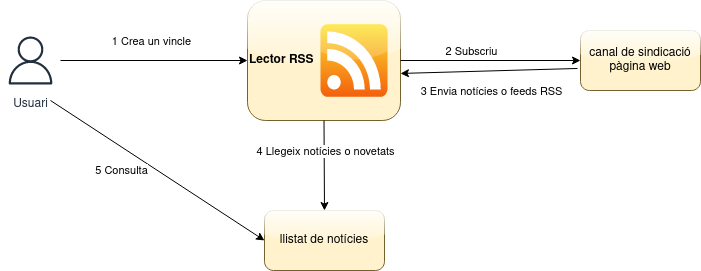

# Tema X. Sindicació de continguts (RSS)
## 7.1 Què es la sindicació de continguts?

Comencem plantejant una situació en la qual ens podem trobar tots:

> La Paula cada matí es connecta a la xarxa per visitar els seus 5 blogs favorits per veure que hi ha de nou. Després visita un parell de llocs de notícies també per veure que hi ha de nou. Finalment visita el lloc web del seu grup de música favorit per veure si hi ha alguna novetat.
>
> En total ha visitat 8 llocs i segurament en molts d'aquests llocs no ha trobat cap novetat.
>
> En tot aquest procés ha invertit 30 minuts del seu preuat temps.
>
> Si la Paula conegués la sindicació, es podria subscriure als canals de sindicació dels llocs webs que visita diàriament (si aquests tenen canals de sindicació) i rebre les novetats al seu ordinador sense perdre els 30 minuts de cada matí.

La sindicació de continguts també es coneix amb el nom de redifusió web, ja que es fa servir principalment perquè l'usuari rebi informació actualitzada dels mitjans de comunicació, els titulars de les últimes notícies d'un diari digital, articles de blogs, empreses, etc., de les quals l'usuari està interessat a rebre de manera continuada i actualitzada les últimes novetats o notícies.

D'aquesta manera l'**usuari no va a cercar la informació**, sinó que la **informació arriba a ell**.

RSS és un vocabulari XML, que té diferents formats. Va començar a la xarxa Netscape a finals dels 90 i ha crescut com a format per a la sindicació de continguts. Els llocs web generen documents RSS que bàsicament son resums de la web (poden ser posts, notícies, etc. que s'actualitzen freqüentment), poden incloure titulars, descripció de continguts, enllaços a webs i gràfics.

Actualment les versions més populars de RSS son les següents:

* RSS 0.91 http://backend.userland.com/rss091 i http://www.scripting.com/netscapeDocs/RSS%200_91%20Spec,%20revision%203.html, també anomenat **Rich Site Summary**.

* RSS 1.0 http://web.resource.org/rss/1.0/spec, també anomenat **RDF Site Summary**.

* RSS 2.0 http://blogs.law.harvard.edu/tech/rss), també anomenat **Really Simple Syndication**.

* Atom http://atomenabled.org/ que està guanyant popularitat.

## 7.2 Arquitectura de RSS

Arquitectura general dels lectors de RSS o agregadors de continguts.



## 7.3 Lectors RSS

Existeixen diferents lectors RSS, també anomenats agregadors de notícies, per a les diferents plataformes.

|Nom lector     | Plataformes               |Gratuit        |
|---------------|---------------------------|---------------|
|Feedly         | Android                   |Si             |
|Inoreader      | Android, Windows, Linux   |Si, premium    |
|NewsBlur       | Android                   |Si             |
|Pocket         | Android                   |Si, premium    |
|Feedreader     | Web, Windows, Linux       |Si             |
|QuiteRSS       | Windows, Linux            |Si             |
|Tiny Tiny RSS  | Docker                    |Si             |


## 7.4 Format d'un document RSS

A continuació veurem el format d'un document RSS 2.0 que és el més utilitzat.

```xml
<?xml version="1.0"?>
<rss version="2.0">
  <channel>
    <title>Título del canal</title>
    <link>https://www.ejemplo.com/</link>
    <description>Descripción del canal</description>
    <item>
      <title>Título del artículo</title>
      <link>https://www.ejemplo.com/articulo</link>
      <description>Descripción del artículo</description>
      <pubDate>Mon, 21 Dec 2020 12:34:56 GMT</pubDate>
    </item>
    <item>
      <title>Título del segundo artículo</title>
      <link>https://www.ejemplo.com/segundo-articulo</link>
      <description>Descripción del segundo artículo</description>
      <pubDate>Mon, 21 Dec 2020 12:34:56 GMT</pubDate>
      <enclosure url="https://www.ejemplo.com/imagen.jpg" type="image/jpeg" length="12345" />
    </item>
  </channel>
</rss>
```

La descripció dels elements més importants és la següent:

* **rss**: l'arrel de l'arxiu RSS, que indica la versió que fem servir. 
* **channel**: un arxiu pot contenir més d'un canal encara que normalmente només farem servir un. Hi ha elements de canal i elements d'item. Els elements de canal inclouen informació general sobre la pàgina web, com el títol, la descripció, etc.
* **link**: enllaç de la pàgina web
* **description**: descripció de la pàgina web
* **item**: cadascun dels artícles publicats al canal. Conté els elements title, link i description novament.
* **pubDate**: data de publicació de l'article
* **enclosure**: permet afegir una imatge per un dels articles. Conté els atributs url (adreça de la imatge), type (el tipus MIME, és a dir el format de la imatge) i length (el tamany de la imatge en bytes). Aquest element és opcional i només es compatible amb la versió 2.0 de RSS.

## 7.5 Enllaços d'interés

* [The Rise and Demise of RSS](https://twobithistory.org/2018/12/18/rss.html)
* [Google Trends - RSS](https://trends.google.es/trends/explore?date=all&q=rss)