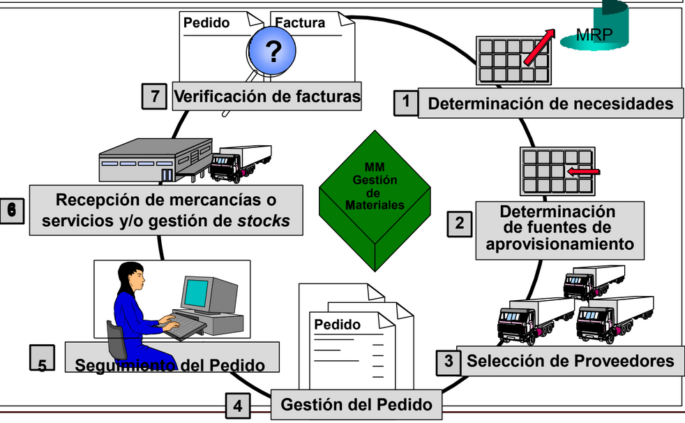

# Tema 10. Sistemes de planificació empresarial (ERPs)

## 10.1 Introducció

Un sistema de planificació empresarial o Enterprise Resource Planning (ERP) són un tipus de software dissenyat per ajudar a les empreses a gestionar els seus processos de negoci i integrar tots els sistemes i dades en un sol sistema centralitzat.

Té les següents característiques:

* A nivell organitzatiu, resol processos de negoci. És a dir, per a cada procés empresarial, per exemple un procés de venda, l'ERP indica quins passos i documents s'han de generar en cada moment. En un procés de venda primer es genera una comanda de vendes, després un document d'entrega i un albarà i després una factura.

* A nivell organitzatiu, permet controlar grans organitzacions, tenint en compte que aquestes poden ser:
    * Multi-idioma
    * Multi-divisa
    * Multi-societat
    * Multi-pla de comptes

* A nivell tècnic:
    * És un sistema integrat. Això vol dir que té totes les funcions necessàries per l'empresa en un únic sistema i aquestes funcions (vendes, compres, finances) estan relacionades entre si.

    * És un sistema modular. Cadascun dels processos organitzatius està dividit en mòduls o seccions, de forma que es poden instal.lar individualment. Aluns dels mòduls que hi poden haver són: producció, compres, vendes, finances, controlling, logística (magatzem), etc.

El sistema ERP més utilitzat a nivell empresarial és SAP. SAP és una empresa alemanya creada el 1972 per varis ex-enginyers de IBM. 

Respecte els ERPs opensource més coneguts tenim [Odoo](https://www.odoo.com/es_ES) i [Openbravo](https://www.openbravo.com/es) [Wiki](http://wiki.openbravo.com/wiki/Installation/Ubuntu)

## 10.2 Mòduls d'un ERP

Tal com hem comentat, un ERP controla diversos processos de negoci, modelant cadascuna de les fases de cada departament de l'empresa. Els principals mòduls són els següents. Els mòduls es poden dividir en dos tipus, mòduls financers i mòduls logístics.

### 10.2.1. Finances

Aquest és el mòdul principal i permet tenir un llibre de contabilitat elèctronic (deure, haver, moviments). És el nucli del ERP doncs tota la resta de mòduls fan apunts contables automàticament en algunes de les operacions que duun a terme.

Té altres submoduls com Tesoreria (gestió de l'efectiu), amortitzacions, etc.

### 10.2.2. Controlling

Aquest és un mòdul financer amb el propòsit d'analitzar els gastos e ingresos dintre de l'empresa. Per exemple, s'encarrega de calcular el cost d'un producte tenint en compte els costos de fabricació: materia prima, mà d'obra directa e indirecta. S'encarrega de l'anàlisi de la rentabilidad per segments de mercat, productes, zones geográfiques, canals vendes. Rentabilitat: ingresos - despeses.

### 10.2.3. Vendes

Permet dur a terme tot el procés des de que el client fa la comanda fins que el producte arriba a la seva casa. Inclou la gestió de documents com ofertes, gestió del crèdi, comanda de venda, document d'entrega, albarà i factura. A continuació s'adjunta el fluxe general per al procés de vendes a un ERP.

### 10.2.4. Compres

S'encarrega de l'aprovisionament de les matèries primes per poder fabricar el producte a vendre, màquines, consumibles, etc. També permet fer una gestió automàtica de les compres segons l'stock, el temps de reaprovisionament i el volum de vendes (MRP automàtic). A continuació s'adjunta el fluxe general per al procés de compres a un ERP.

### 10.2.5. Logística

S'encarrega de les gestions relacionades amb els matgatzem. Permet gestionar l'stock, moviments entre magatzems inventaris, etc.

### 10.2.6. Producció

És un dels mòduls més importants, doncs s'encarrega de gestionar el procés productiu. Té documents com el full de ruta (passos per a fabricar un producte determinat a la cadena de producció), el BOM (bill of materials), cost del producte, gestió dels materials...

### 10.2.7. Recursos Humans

Tracta amb tots els processos relacionats amb els empleats: contratació, formació, control del temps (horaris), despeses de viatge, remuneracions (càlcul de la nòmina), gestió del talent, etc.

### 10.2.10. Qualitat 

Molt relacionat amb el mòdul de producció. S'encarrega de gestionar els lots de producció, fer anàlisis del productes per verificar que compleixen una sèrie d'estàndars o normes, que tenen les característiques físiques o químiques necessàries, etc.

## 10.3 CRM

Un CRM (Customer relationship management) o gestor de relacions amb els clients és un sistema de gestió d'informació que permet centralitzar en una única base de dades totes les interaccions entre una empresa i els seus clients, principalment en tres àrees:

* La **gestió comercial**:

    El CRM recopila tota la informació de les gestions comercials mantenint un històric detallat, d'aquesta manera permet compartir i maximitzar el coneixement d'un client donat entenen les seves necessitats i anticipant-se a elles.

    Els CRM generen pressupostos actualitzats en temps real i processos de vendes optimitzats, fent que les empreses generin més oportunitats de venda i agilitzin la seva gestió.

* El **màrqueting**: Gràcies al CRM es pot controlar el conjunt d'accions realitzades sobre els clients o clients potencials, d'aquesta manera permet dirigir i gestionar de forma més senzilla les campanyes de captació de clients i de fidelització.

* El **servei postvenda** o d'atenció al client: Els CRM proporcionen a l'empresa la informació necessària permetent que aquesta ofereixi un servei d'atenció al client i postvenda de nivell superior.

Un dels sistemes CRM més coneguts és Siebel, una empresa nordamericana fundada el 1993. El 2005 va ser adquirida per Oracle, el gran rival de SAP.

Un altre sistema CRM basat en el núvol es Salesforce, creat per un antic executiu d'Oracle.

## 10.3 Bussiness Intelligence (BI)

Un altre software molt relacionat amb els ERPs són les eines de Bussiness Intelligence (BI). Els ERPs generalment funcionen sobre un sistema de base de dades relacionals (Oracle, Microsoft SQL Server) i s'encarreguen de les transaccions OLTP. Els sistemes OLTP (Online Transaction Processing) són sistemes que tenen una resposta immediata al usuari. Per exemple, els sistemes que impliquen processos de producció, de vendes, logística no poden trigar més d'uns segons perquè hi ha altres processos que depenen d'ells.

Per altra banda tenim els sistemes OLAP (Online Analytical Processing) com els sistemes BI. Aquests sistemes s'encarreguen de l'anàlisi de dades. Generalment estan connectats als sistemes OLTP i carreguen dades periòdicament per al seu processament. Aquests sistemes serveixen per entendre tendencies (quins productes es venen més o menys), treure conclusions i ajudar als directius de l'empresa a prendre decisions de negoci.

Alguns dels productes més coneguts de BI són:

* SAP Bussiness Intelligence (SAP BI).
* Tableau
* QlikView

Aquest document està llicenciat sota els termes de la [Licencia Creative Commons Attribution 4.0 International (CC BY 4.0)](LICENSE.md).