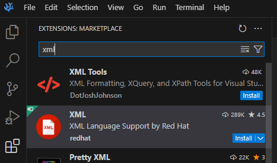
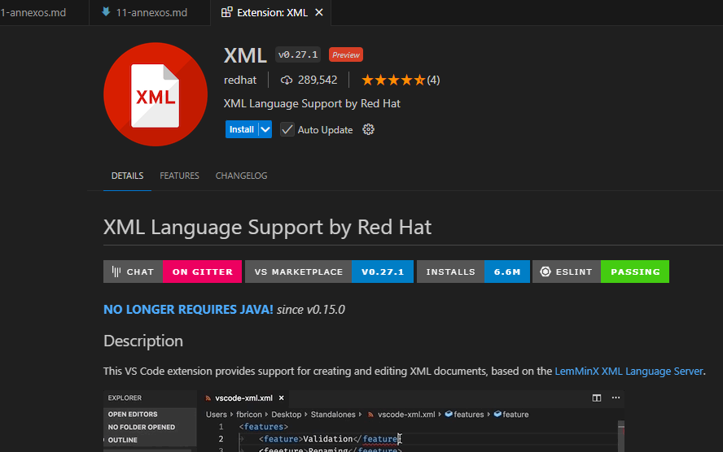
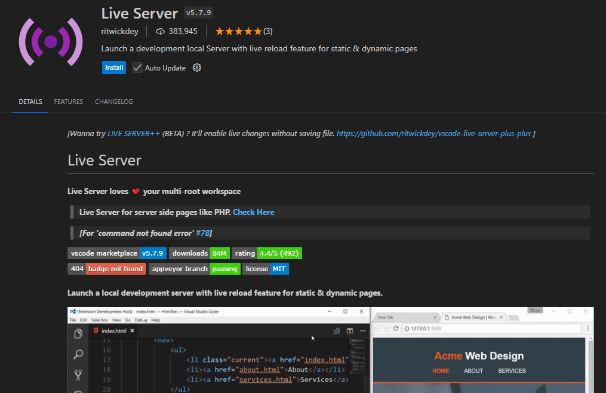
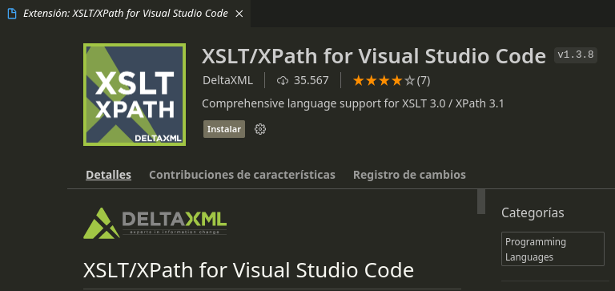
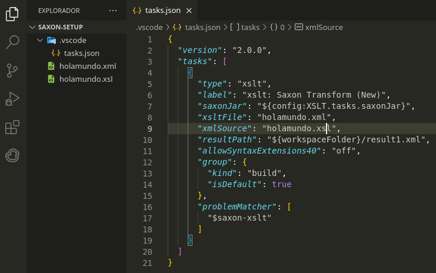

# Annexos

## Annex 1. Instalació i configuració VSCodium.

Per crear els nostres arxius xml utilitzarem el software VSCodium, basat en el mateix codi font que Visual Studio Code però amb telemetria deshabilitada i amb un altre logo.

* [VSCodium Open Source Binaries of VSCode](https://vscodium.com/)
* [Releases VSCodium](https://github.com/VSCodium/vscodium/releases)

Primer, descarrega i instal·la la versió de VSCodium segons el teu S.O (Win10, Debian). 
Després, anirem a instal·lar la nostra primera extensió a VSCodium. Per tal de fer-ho anem a Extensions (panell lateral), busquem el terme "xml" a la casella i instal·lem l'extensió seleccionada (XML Redhat).






## Annex 2. Extensions VSCodium per a HTML.

Per tal de poder previsualitzar les pàgines ràpidament i millorar el formateig d'HTML es recomanen les següents extensions:

**Extension XML VSCodium Live Server**



Altres extensions interessants són CSS Peek Name: [CSS Peek](https://marketplace.visualstudio.com/items?itemName=pranaygp.vscode-css-peek) i [HTML CSS support](https://marketplace.visualstudio.com/items?itemName=ecmel.vscode-html-css)

## Ànnex 3. Instalació Saxon SXLT a Visual Studio.

!!! quote "Atenció "

    Aquest procediment només serveix per a Visual Studio Code, no per a VSCodium per una questió relacionada amb les llicències de Microsoft.

Per tal de processar els nostres documents XML i generar una sortida amb XSLT necessitem un processador. Per instal.lar el processador Saxon SXLT a Visual Studio Code:

1. Descarregar l'última versió de **Saxon Home Edition (Saxon-HE)** des de la pàgina oficial: [Saxon SXLT and XQuery Processor](https://saxon.sourceforge.net/#F11HE). No cal descarregar ni els exemples ni el codi font. 

2. Descomprimir el contingt en una carpeta del vostre equip, p. ex. c:Saxon a Windows o /users/home/usuari/Saxon a Linux.

3. Instal.leu l'extensió **XSLT/XPath for Visual Studio Code** per a Visual Studio Code.



4. Aneu a la configuració. Premeu **F1** a Visual Studio i escriviu Preferencias: **Abrir Configuracion (IU)**. A buscar escriviu **XSLT** i canvieu els següents paràmetres:
  
* Desmarqueu Enable Saxon-JS tasks (i comproveu que Enable Saxon tasks està marcada). Ompliu la ruta amb el processador Saxon que heu descarregat, p. ex. /home/salva/Saxon/saxon-he-11.4.jar.


Això només ho hem de fer un cop. Ara anem a configurar una tasca de compilació per especificar els arxius origen i destí de la nostra conversió.

1. Premem F1 i escrivim **"Configure default build task"**. La primera vegada no tindrem cap i ens demanarà configurarl-la. Seleccionem "xslt: Saxon Transform (New)" i ens crearà un arxiu de configuració tasks.json. Omplim amb els paràmetres necessàris:

* **xsltFile** posem el nom del nostre arxiu XSL
* **xmlSource** podem el nom del origen XML
* **resultPath** escrivim el nom del fitxer de sortida (normalment XML).



2. Per fer la conversió, hem de buscar dos arxius tant XML com XSL que siguin correctes. Per assegurar-nos, podem probar la nostra conversió amb un processador on-line. Premem **F1** i escrivim **"Run Build Task"**. Si tot ha anat bé, a la nostra carpeta tindrem un arxiu nou amb la transformació feta.
  

Més informació:

* [Running SXLT](https://deltaxml.github.io/vscode-xslt-xpath/run-xslt.html)

Aquest document està llicenciat sota els termes de la [Licencia Creative Commons Attribution 4.0 International (CC BY 4.0)](LICENSE.md).

## Ànnex 4. JavaScript per a Principiants

JavaScript és un llenguatge de programació que permet afegir interactivitat i dinamisme a les pàgines web. Si alguna vegada has vist un botó que canvia de color en passar-hi el ratolí per sobre, o una finestra emergent que et demana el nom això es pot fer amb JavaScript. A diferència d'altres llenguatges que funcionen al servidor, JavaScript s'executa directament al navegador de l'usuari, cosa que el fa ideal per a la creació d'interfícies interactives.

Javascript és l'únic llenguatge que s'utilitza a la part client (navegador) i per tant és molt popular.

### Conceptes Bàsics

- **Codi Font**: JavaScript és un llenguatge basat en text, això vol dir que s'escriu en fitxers de text i s'integra a les pàgines web utilitzant etiquetes `<script>`.
    Exemple:

    ```html
    <!DOCTYPE html>
    <html>
        <head>
        </head>
        <body>
           <script>
                //el meu codi Javascript
            </script>
        </body>
    </html>
    ```

    El codi Javascript es pot ubicar 
- **Variables**: Les variables són espais on podem guardar informació (nombres, text, etc.) que després podem reutilitzar. Hi ha diverses maneres de declarar variables en JavaScript, però les més comunes són let, const, i var.

    ```javascript
    let nom = "Joan";  // Una variable que guarda un text
    const pi = 3.14;   // Una constant que no canviarà el seu valor
    ```

    Exemple:

    ```javascript
    <h2 id="missatge_pi"></h2>
    
    <script>
      let nom = "Joan";  
      const pi = 3.14;   

      let h2 = document.getElementById("missatge_pi");
      h2.innerHTML = "Hola em dic " + nom + " i el valor de pi és " + pi;

      //també console.log("Hola em dic " + nom + " i el valor de pi és " + pi);
    </script>    
    ```

- **Funcions**: Una funció és un conjunt d'instruccions que s'executen seqüencialment i permeten dur a terme una tasca concreta, per exemple donat un numero enter positiu, la funcio arrel2() retorna l'arrel quadrada del número. Les funcions són blocs de codi que podem definir una vegada i reutilitzar cada vegada que les cridem. Una funció pot acceptar dades (anomenades "paràmetres") en format de llista de variables (var1, var2,..,varn) i retornar un resultat. 

    ```javascript
    function saludar(nom) {
        return "Hola, " + nom;
    }
    ```

    Exemple:
    ```javascript
    let nom = "Joan";  

    function acomiadar(nom) {
        return "Fins aviat " + nom;
    };
    
    console.log(acomiadar(nom));
    ```

- **Esdeveniments**: JavaScript pot reaccionar a diferents accions de l'usuari, com fer clic en un botó, moure el ratolí o escriure en un camp de text. Aquestes reaccions s'anomenen "esdeveniments".

    ```javascript
    <button id="elMeuBoto">Fes clic</button>

    document.getElementById("elMeuBoto").addEventListener("click", 
    function() {
        alert("Has fet clic al botó!");
    }
    );
    ```

- **Manipulació del DOM**: El DOM (Document Object Model) és la representació estructural d'una pàgina web que el navegador crea a partir d'un fitxer HTML. JavaScript pot interactuar amb el DOM per a canviar el contingut o l'aparença d'una pàgina sense necessitat de recarregar-la.

    Per exemple, podem canviar el text dins d'un element HTML:

    ```javascript
        document.getElementById("elMeuText").innerHTML = "Nou text";
    ```

### Activitat Pràctica

Per posar en pràctica els conceptes bàsics, crearem una petita aplicació que canviï el color de fons de la pàgina quan l'usuari faci clic en un botó.

En el teu fitxer HTML, crea un botó i un paràgraf:

```html
<button id="canviarColor">Canviar color</button>
<p id="elMeuText">Aquest és un paràgraf.</p>
```

Ara, escriu el següent codi JavaScript per canviar el color de fons de la pàgina:

```javascript
document.getElementById("canviarColor").addEventListener("click", 
    function() {
    document.body.style.backgroundColor = "lightblue";
});
```

Aquest codi li diu a JavaScript que esperi que l'usuari faci clic al botó amb l'id canviarColor, i quan això passi, canviarà el color de fons de la pàgina.
Ampliacions

- Fes que hi hagi un altre botó al costat que torni al color de fons per defecte.
- Inclou un color picker per a que l'usuari esculli un color.

Ara estàs preparat per començar a crear aplicacions senzilles amb JavaScript!
