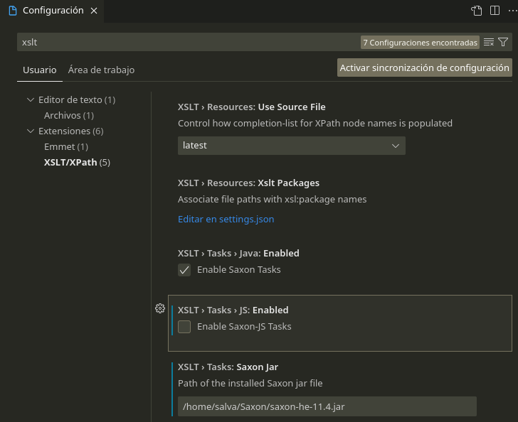

# Annexos

## Annex 1. Instalació i configuració VSCodium.

Per crear els nostres arxius xml utilitzarem el software VSCodium, basat en el mateix codi font que Visual Studio Code però amb telemetria deshabilitada i amb un altre loco

* [VSCodium Open Source Binaries of VSCode](https://vscodium.com/)
* [Releases VSCodium](https://github.com/VSCodium/vscodium/releases)

Primer, descarrega i instal·la la versió de VSCodium segons el teu S.O (Win10, Debian). 
Després, anirem a instal·lar la nostra primera extensió a VSCodium. Per tal de fer-ho anem a Extensions (panell lateral), busquem el terme "xml" a la casella i instal·lem l'extensió seleccionada (XML Redhat).

## Annex 2. Instalació Saxon SXLT a Visual Studio.

Per tal de processar els nostres documents XML i generar una sortida amb XSLT necessitem un processador. Per instal.lar el processador Saxon SXLT a Visual Studio Code:

1. Descarregar l'última versió de **Saxon Home Edition (Saxon-HE)** des de la pàgina oficial: [Saxon SXLT and XQuery Processor](https://saxon.sourceforge.net/#F11HE). No cal descarregar ni els exemples ni el codi font. 

2. Descomprimir el contingt en una carpeta del vostre equip, p. ex. c:Saxon a Windows o /users/home/usuari/Saxon a Linux.

3. Instal.leu l'extensió **XSLT/XPath for Visual Studio Code** per a Visual Studio Code.

4. Aneu a la configuració. Premeu **F1** a Visual Studio i escriviu Preferencias: **Abrir Configuracion (IU)**. A buscar escriviu **XSLT** i canvieu els següents paràmetres:
  
* Desmarqueu Enable Saxon-JS tasks (i comproveu que Enable Saxon tasks està marcada). Ompliu la ruta amb el processador Saxon que heu descarregat, p. ex. /home/salva/Saxon/saxon-he-11.4.jar.

Això només ho hem de fer un cop. Ara anem a configurar una tasca de compilació per especificar els arxius origen i destí de la nostra conversió.

1. Premem F1 i escrivim **"Configure default build task"**. La primera vegada no tindrem cap i ens demanarà configurarl-la. Seleccionem "xslt: Saxon Transform (New)" i ens crearà un arxiu de configuració tasks.json. Omplim amb els paràmetres necessàris:

* **xsltFile** posem el nom del nostre arxiu XSL
* **xmlSource** podem el nom del origen XML
* **resultPath** escrivim el nom del fitxer de sortida (normalment XML).

2. Per fer la conversió, hem de buscar dos arxius tant XML com XSL que siguin correctes. Per assegurar-nos, podem probar la nostra conversió amb un processador on-line. Premem **F1** i escrivim **"Run Build Task"**. Si tot ha anat bé, a la nostra carpeta tindrem un arxiu nou amb la transformació feta.
  

Més informació:

* [Running SXLT](https://deltaxml.github.io/vscode-xslt-xpath/run-xslt.html)

Aquest document està llicenciat sota els termes de la [Licencia Creative Commons Attribution 4.0 International (CC BY 4.0)](LICENSE.md).